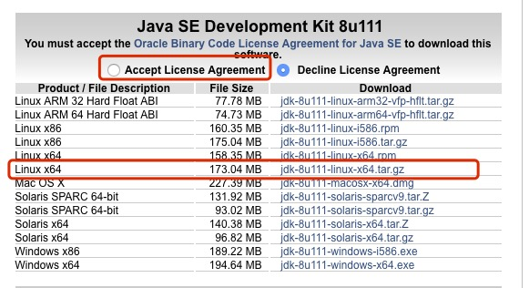
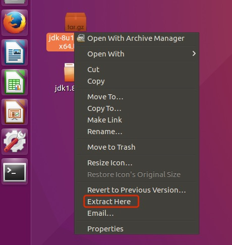
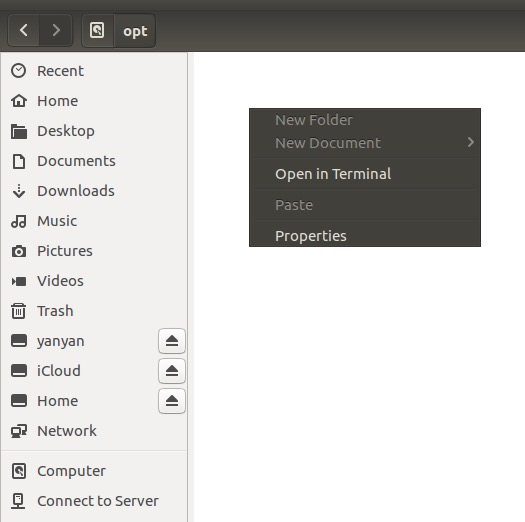
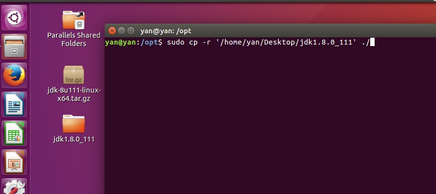
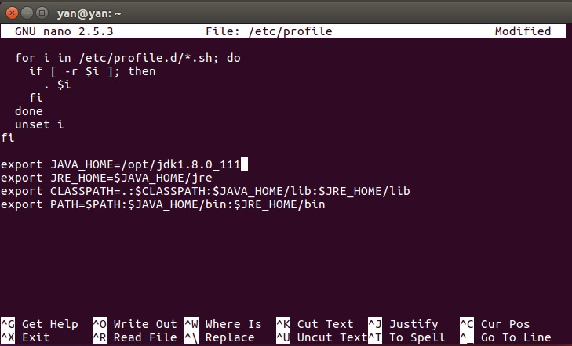

# Ubuntu

## 1.官网下载JDK

*地址：http://www.oracle.com/technetwork/java/javase/downloads/jdk8-downloads-2133151.html*



这里我下载的是jdk8，注意勾选上Accept License Agreement。

## 2.解压缩



## 3.拷贝JDK

把文件拷贝到~/opt文件夹下。


先进去这个路径中，右键点击Open in Terminal。



将解压缩后的jdk拷贝到~/opt路径下

```
sudo cp -r '/home/yan/Desktop/jdk1.8.0_111' ./
```



## 4.配置环境变量

键入命令：

```
sudo nano /etc/profile
```

在最后一行添加以下内容：

```
export JAVA_HOME=/opt/jdk1.8.0_111
export JRE_HOME=$JAVA_HOME/jre
export CLASSPATH=.:$CLASSPATH:$JAVA_HOME/lib:$JRE_HOME/lib
export PATH=$PATH:$JAVA_HOME/bin:$JRE_HOME/bin
```



ctrl+x退出编辑，输入y确认保存，再回车。

重新执行配置文件，键入命令：

```
source /etc/profile
```

最后，验证jdk是否已安装成功，键入以下命令：

```
java -version
```


