## 1 引言

### 1.1 JMeter介绍

Apache JMeter是开源软件，它可以用来做负载测试和性能测试。它最初设计是用来测试Web应用程序，但现已扩展到其他测试功能。

Apache JMeter可以用来测试包括基于静态和动态资源程序的性能，例如静态文件，Java Servlets，Java对象，数据库，FTP服务器等等。Jmeter可以模拟一个在服务器、网络或者对象上大的负载来测试或者分析在不同的负载类型下的全面性能。

另外，JMeter能够通过用断言创造测试脚本来验证我们的应用程序是否返回了我们期望的结果，从而帮助我们回归测试我们的程序。为了最大的灵活性，JMeter允许我们使用正则表达式创建断言。

### 1.2 自动化测试

何谓自动化测试？

一般是指软件测试的自动化，软件测试就是在预设条件下运行系统或者应用程序，评估运行结果，预先应包括正常条件和异常条件。

自动化测试的优缺点：

**- 优点：**

1. 节省人力，只要代码维护得好，不需要那么多人就可以完成测试。
2. 节省时间，测试脚本可以晚上或者周末跑。
3. 优化资源分配，在运行测试脚本的同时，QA可以做其他事情，比如设计新的测试用例。
4. 方便回归测试，极大提高了工作效率。
5. 增加软件的可信度，测试是机器执行的，一定程度上排除了因人工测试所造成的忽略性错误，测试结果更加可信。
6. 能完成手工不容易控制的测试工作，比如对于大量用户的测试，不可能同时让足够多的测试人员同时进行测试，但是却能通过自动化测试模拟同时有很多用户操作，从而达到测试的目的。

**- 缺点**

1. 脚本维护成本高，尤其是版本变动比较大的，对于项目来说是潜在的风险。
2. 不能在发现新的bug。

### 1.3 阅读对象

对JMeter有一定的了解，会使用JMeter做接口测试的人。

### 1.4 定义与名词解释

- EL：Expression Language，简称EL。通过EL，我们只需要使用`${expression}`就可以引用对象，极大的增加了程序的可读性及可维护性。
- API：Application Programming Interface，应用程序编程接口。


## 2 核心元件

本文档主要作为接口自动化测试的入门，讲解接口自动化测试中常用的元件。

本文档不对JMeter安装、环境设置等再做介绍，若对JMeter完全陌生者，请自行学习JMeter的基本使用后再查阅本文档。

### 2.1 用户定义的变量

假设你有一个场景是这样的，你有很多个接口都要用到同一个参数，并且这个参数它的至不是固定不变的。在没有使用用户定义的变量这个元件时，每一次这个参数改变了值，你都必须到用到它的每一个http请求去修改值，如果此时你有一百个这样的接口，显然这样的修改方式也是一件艰巨的任务。

解决这种情况，『用户定义的变量』这个元件是个不错的选择。他允许你定义一个参数，接口用到它只需要通过EL表达式来获取定义的值，这样一来，当参数的值变化时，你只需要改动一个地方，即可完成这上百个接口的修改。

新建配置元件『用户定义的变量』。

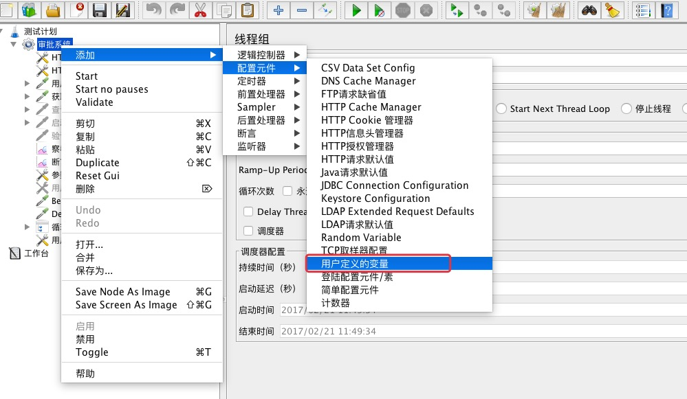

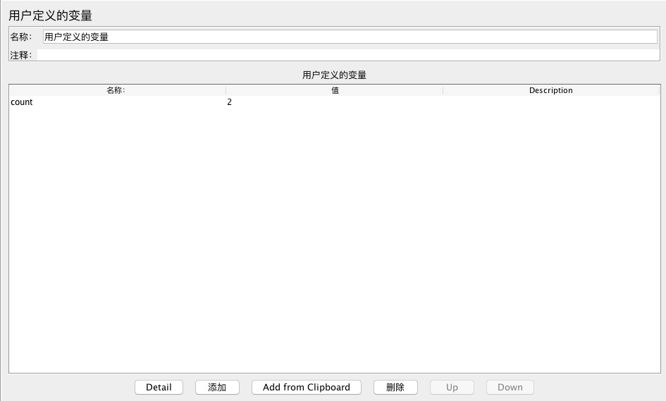

点击添加按钮新增一个变量，输入变量的名称和默认值，我们在使用参数时可以通过定义的名称${parameter}来获取变量的值。如下图所示：

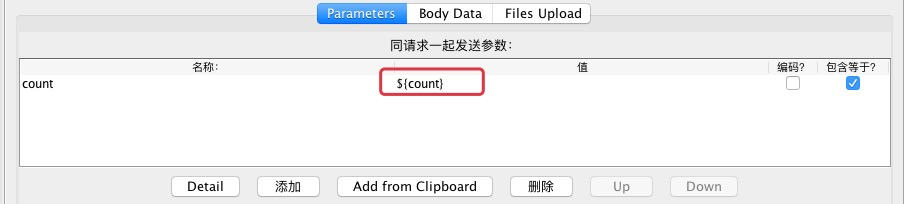

通过EL表达式，我们可以获取定义的值，当然如果你懂Java语言，你也可以通过BeanShell去修改这个值。关于BeanShell的一些介绍，我们会在接下来的章节提到。

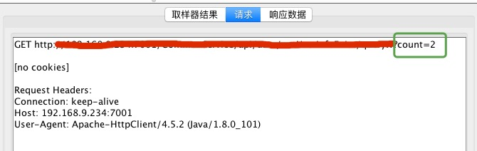

另外，除了使用『用户定义的变量』这个元件，其实在『测试计划』中也有一个地方可以定义全局参数。如下图所示：

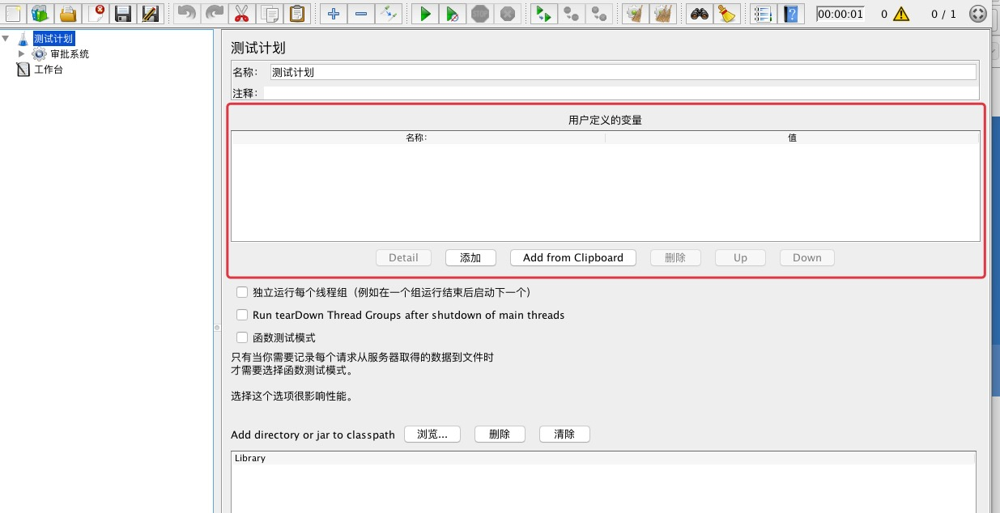

这两个地方创建的变量，都可以使用${parameter}来获取定义的值。

### 2.2 CSV Data Set Config

JMeter支持使用外部文件来保存接口测试时所要使用的参数，当我们配置了CSV Data Set Config这个元件后，JMeter会根据我们的配置使用指定的文件中的值作为参数。

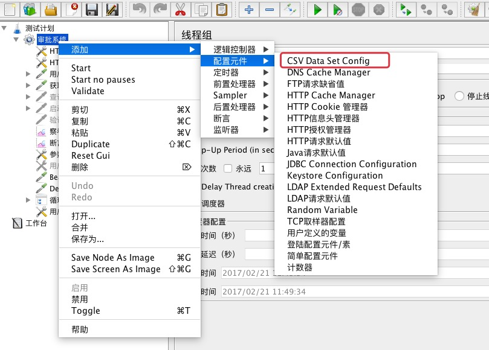

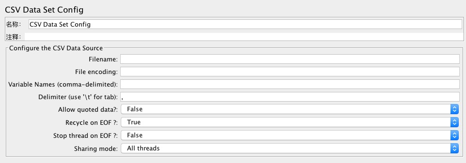

- Filename：所要引用的外部文件路径，若该文件是存放在JMeter的bin目录下，那么这里只需要文件名。但是一般是不建议放在bin目录下的，推荐在存放接口测试脚本目录下创建一个data文件夹用来存放测试的数据。
- File encoding：使用什么编码读取文件，一般我们是使用UTF-8。
- Variable Names：这里表示的是存放数据的文件中列对应的参数名，这个参数名的设置是便于我们使用EL表达式来获取文件中列所对应的值。
- Delimiter：文件分隔符，这里默认是使用`,`（注意是英文逗号）作为列之间的分隔符。在这里也是比较推荐使用英文逗号作为分隔符。
- Allow quoted data?：是否允许值包含分隔符，默认为false。当设置为true时，参数允许存在逗号、双引号，但注意需要使用`""`（英文双引号）括起来。如：1,"2,3","4""5"。这个是Apache JMeter官网上的解释，我理解后用简单的语句翻译了一下。
- Recycle on EOF?：当读到文件结束符时，是否重头读文件。默认为true。
- Stop thread on EOF?：当读到文件结束符时，线程是否停止。默认为false。
- Sharing mode：
  - All Threads：这个文件将被所有线程都能读取到。
  - Current thread group：只有在当前线程组才能访问得到这个文件。
  - Current thread：只有在当前线程才能访问到这个文件。

***下面给出的一个例子：***

创建帐号密码的外部存储文件，这里我使用的是.txt文件。

以公司测试环境的审批系统为例，在CommonService-userCode.txt文件里面保存登录名和密码，如下图所示：

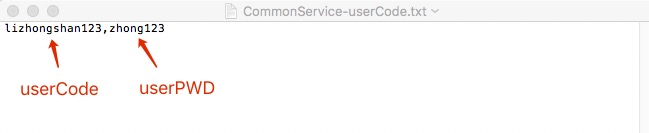

线程组配置CSV Data Set Config元件，如下图所示：

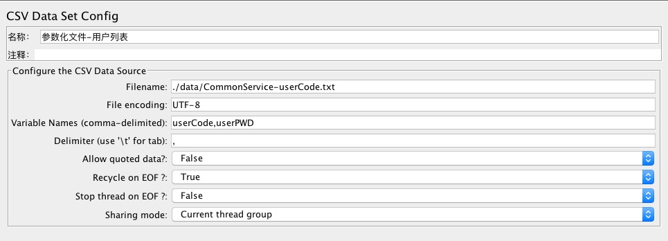

接口使用EL表达式获取值，如下图所示：

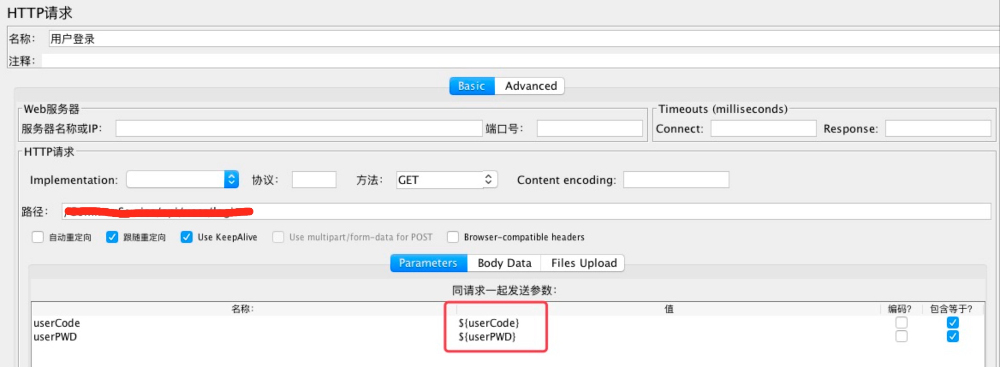

### 2.3 正则表达式提取器

JMeter支持使用正则表达式提取返回的响应文，比如你有一个接口是使用了上一个接口返回结果的某一个值作为参数，此时你就可以使用正则表达式提取器提取上一个接口返回的值，作为下一个接口调用的参数值。

JMeter的正则表达式和Perl5非常相似，一个很显著的区别是在Perl5正则表达式中使用`//`作为分隔符，而JMeter是使用`()`。

选中所要提取返回结果的http请求，添加后置处理器-->正则表达式提取器，如下图所示：

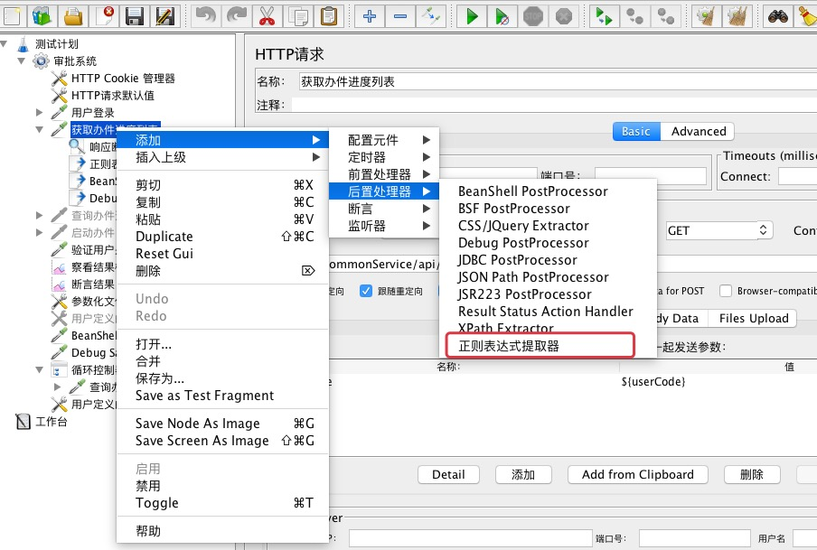

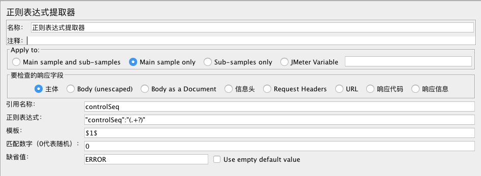

- 引用名称(Reference Name)：请求时引用的参数，同样是使用${parameter}获取。
- 正则表达式(Regular Expression)：匹配提取的内容。
- 模板(Template)：用于提取匹配到的值，使用`$index$`提取匹配的值，这个参数用文字不好解释，下面我还是用具体的例子来详细说明这个参数的具体用法。
- 匹配数字(Match No.)：当匹配的内容有多个时，可以使用该参数来设置要提取某个匹配。就像Java的Matcher.group()是一个意思。可以把匹配的内容看成是一个数组，而匹配数字指的就是数组的下标（下标从1开始）。这里0不表示这个结果的起始值，而是表示随机值，使用1表示获取第一个匹配值，使用2表示获取第二个匹配值，当输入的数字大于匹配到的数组长度时，返回默认值，也就是接下来会讲到的缺省值。
- 缺省值(Default Value)：当匹配不到内容时设置参数的默认值。如上图将默认值设置为『ERROR』，当匹配不到内容controlSeq=ERROR。

为了便于查询匹配到的结果和相关信息，建议加上Debug PostProcessor这个元件。

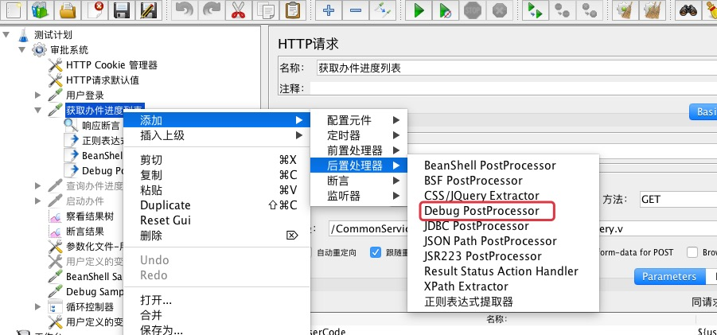

添加后我们在`察看结果树`就可以通过Debug PostProcessor来查看匹配结果。如下图可以看到最终匹配结果是：`controlSeq=2017116334`

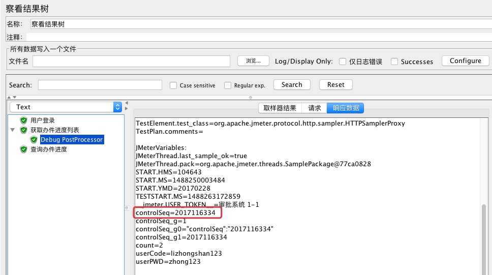

通过正则表达式提取接口返回的值，并设置好引用的名称，我们可以使用EL表达式将提取到的至作为下一个接口的请求参数。如下图所示：

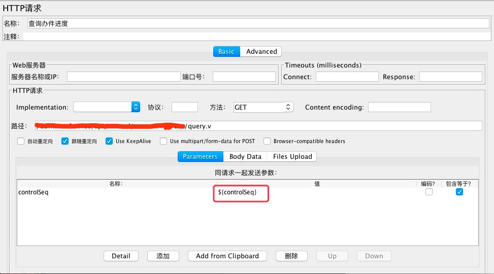

最后，我们可以通过`察看结果树`查看到请求参数的值。如下图所示：

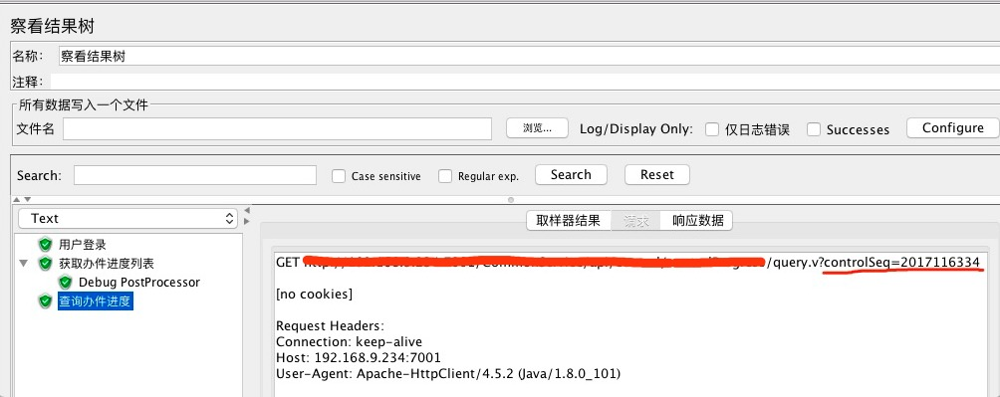

<font color="#ff0000">**接下来，我想详细说明一下模板(Template)这个参数的具体用法。**</font>

**如果你懂Java代码，这个模板的作用其实就跟Java的Matcher.group(int index)是一样的，那么你可以直接过这一章节。如果你不懂代码，或者对Matcher.group()这个方法也不是很清楚，那么请你接着看，下面我举了大量的例子来解释。**

在上面的解释中，我只简单的提到这个`模板`是用来提取正则表达式匹配到的值，下面我们用具体例子来详细说明一下这个参数的用法。

当我输入正则表达式`"controlSeq":"(.+?)"`，模板设置为`$0$`，我们到`察看结果树`视图中查看提取结果。

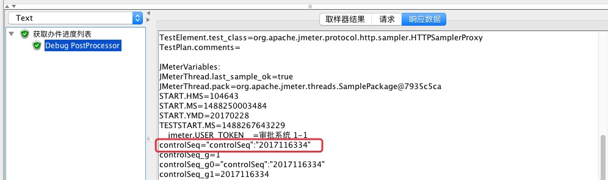

从上图可以看到，`controlSeq="controlSeq":"2017116304"`，即`$0$`表示匹配内容的整体部分。

当我将模板设置为`$1$`，查看提取结果为：`controlSeq=2017116334`，可以看到`$1$`表示提取括号中匹配的内容。

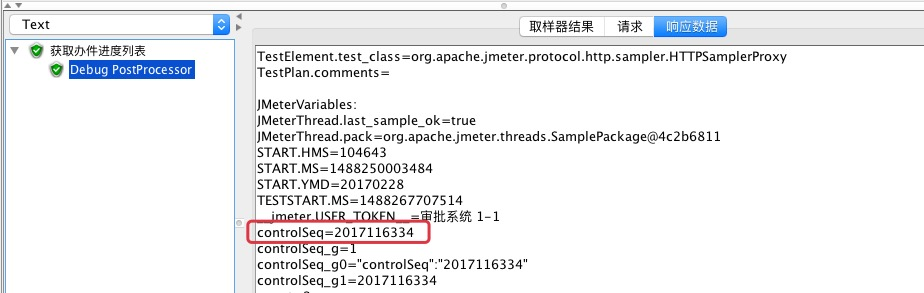

当我将模板设置为`$2$`，查看提取结果为：`controlSeq=null`，可以看到`$2$`并没有提取到任何匹配到的内容，所以返回null。

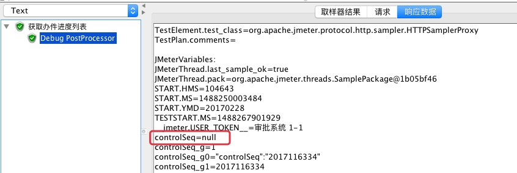

好吧，这个正则表达式给到的提示还是比较少，我试着用另外一个复杂一点的表达式来描述。

正则表达式`"controlSeq":"(.+?)","beginDate":((.+?){13}),"approveSeq":"(.+?)"`，我们就使用这个表达式作为例子。

同样，当我将模板设置为`$0$`，提取结果为：`controlSeq="controlSeq":"2017116334","beginDate":1487591184000,"approveSeq":"4772"`，这个结论与之前说的是一致的，`$0$`的确表示提取匹配内容的整体部分，没毛病。

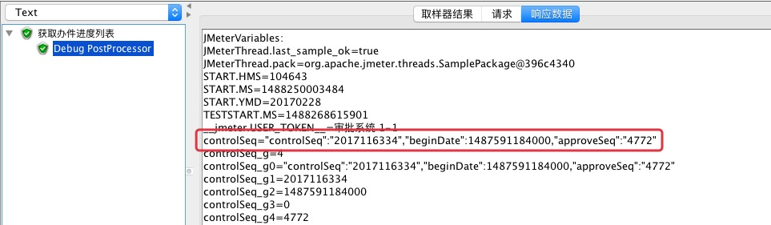

当我将模板设置为`$2$`时，看看会有什么样的结果，是不是还是 <font color="#ff0000">**controlSeq=null**</font>。

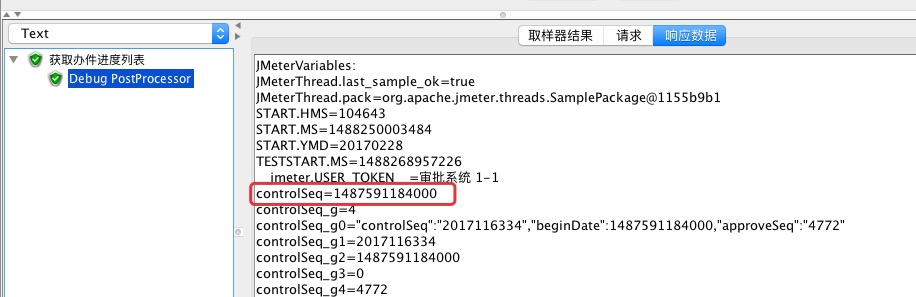

然而我们发现模板提取结果并不是 <font color="#ff0000">**null**</font>，而是<font color="#ff0000">**1487591184000**</font>，结合`$0$`的结果可以发现`$2$`提取的是`((.+?){13})`这个表达式所匹配的内容。

同样，你会发现当你将模板设置为`$3$`时，提取内容为第二个`(.+?)`表达式所匹配的内容。而`$4$`则提取的是最后一个`(.+?)`所匹配的内容。举了这么多例子，想必你也应该知道是怎么一回事了吧。

最后我们来个总结，下面我画了一个图来描述。

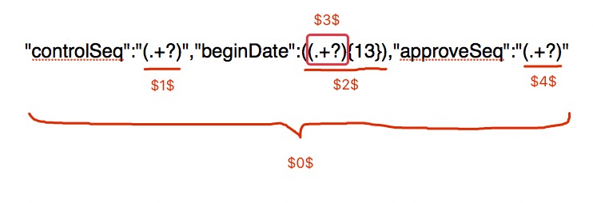

### 2.4 计数器

计数器这个元件，我暂时没想到什么具体的接口测试会用到，或许在分页查询上会使用到。这里我们以一个简单的例子介绍一下。

新建计数器，如下图所示：

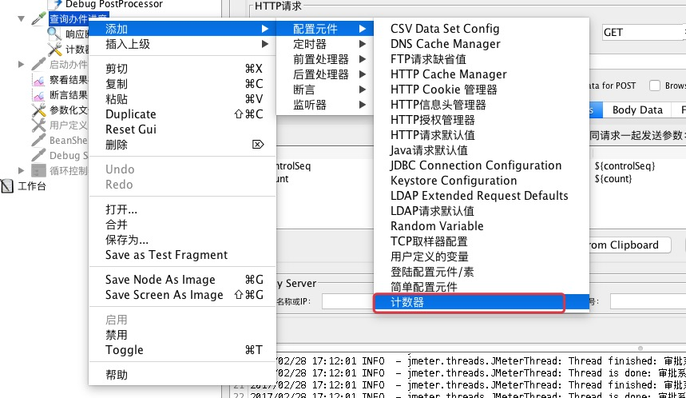

设置启动值为1，每次递增1，最大值为5，引用名称使用count，如下图所示：

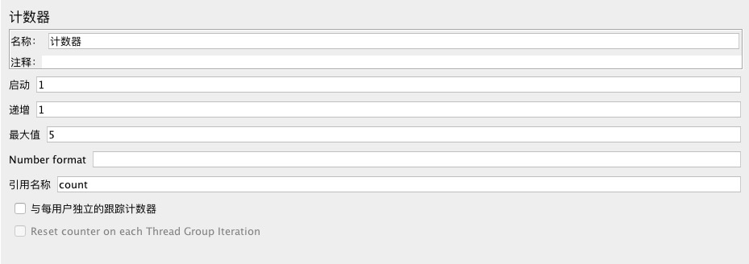

请求参数使用${count}来获取对象的值。

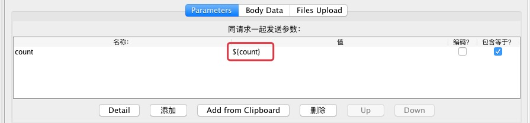

设置线程数为5，如下图所示：

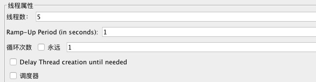

执行结果，如下图所示：

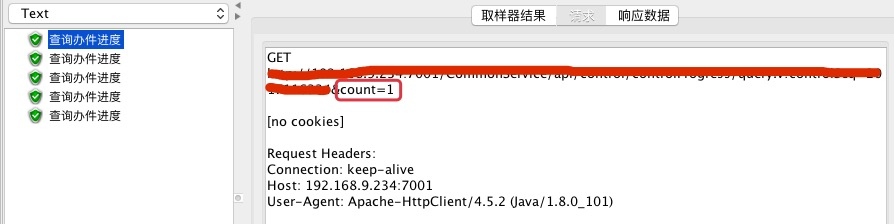

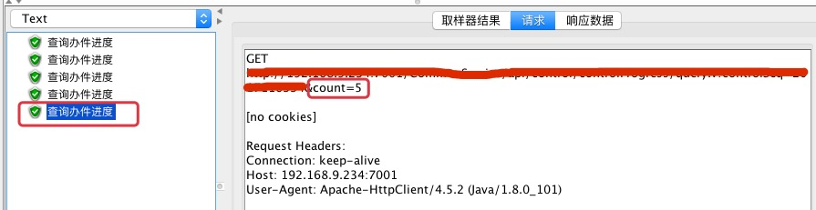

如上图结果可以看到，当我们将线程组数设置为5时，参数`count`从1递增到5。

### 2.5 逻辑控制器

逻辑控制器可以用来控制Samplers的执行顺序，他包括循环控制器、if控制器、事务控制器等等。如图所示：

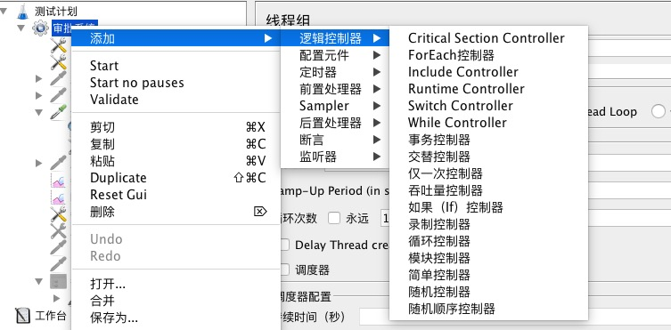

- Critical Section Controller：关键部分控制器确保它的子元素（采样器/控制器等）将只被一个线程执行，因为在执行控制器的子代之前将执行一个命名锁。
- ForEach Controller：ForEach控制器一般和用户自定义变量一起使用，其在用户自定义变量中读取一系列相关的变量。该控制器下的采样器或控制器都会被执行一次或多次，每次读取不同的变量值。
- Include Controller：include控制器设计为使用外部jmx文件。要使用它，请在测试计划下创建一个测试片段，并在其下添加任何所需的Sampler，Controller等。
- Runtime Controller：运行时控制器可以控制子节点允许执行的时间长短。
- Switch Controller：Switch控制器与交替控制器很类似，不同的是Switch控制器是根据您设置的Switch Value来执行某一个子节点。与Java语言中的switch case是一个意思。
- While Controller：While控制器将执行子节点直到条件不满足，与Java语言中的While一致。
- 事务控制器(Transaction Controller)：事务控制器会生产一个额外的采样器，用来统计该控制器子结点的所有时间。
- 交替控制器(Interleave Controller)：当设置了交替控制器，JMeter将每个循环中交替调用每个Sampler。只在设置了循环次数中起作用。
- 仅一次控制器(Once Only Controller)：当你把Sampler放在这个控制器下，每一个线程将只执行一次这个控制器下的Sampler。通常登录接口和授权接口会比较常用到这个控制器。
- 吞吐量控制器(Throughput Controller)：控制子节点的执行次数和负载比例分配。
- If控制器(If Controller)：根据给定的表达式的值决定是否执行子节点，默认是使用JavaScript的语法进行判断。
- 录制控制器(Recording Controller)：记录控制器是一个占位符，指示代理服务器应该在哪里记录样本。在测试运行期间，它没有效果，类似于简单控制器。
- 循环控制器(Loop Controller)：如果你把Sampler放在了循环控制器中，JMeter将按照设置的循环次数执行这些Sampler。跟Java中的for循环是一个意思。
- 模块控制器(Module Controller)：模块控制器提供了一种机制，用于在运行时将测试计划片段替换为当前测试计划。
- 简单控制器(Simple Controller)：控制器中最简单的一个，主要起分组作用，不具备任何逻辑控制功能。
- 随机控制器(Random Controller)：随机控制器与交替控制器很像，区别点在于交替控制器是按顺序交替执行，而随机控制器是随机顺序。
- 随机顺序控制器(Random Order Controller)：随机顺序控制器跟简单控制器一样，不同的是随机顺序控制器是随机执行子节点。

下面将详细介绍循环控制器(Loop Controller)的使用。

添加一个循环控制器，选中线程组，右键添加-->逻辑控制器-->循环控制器，如下图所示：

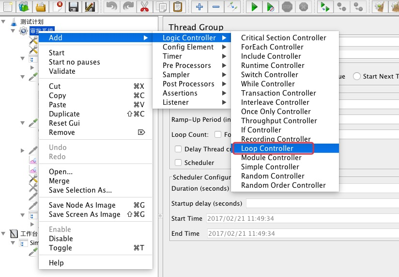

输入循环的次数，如果勾选了永远，将一直循环。如下图输入的循环次数是2。

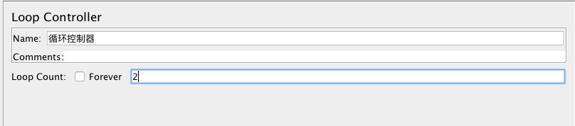

如下图所示，循环控制器中的『查询办件进度』请求被执行了两次。

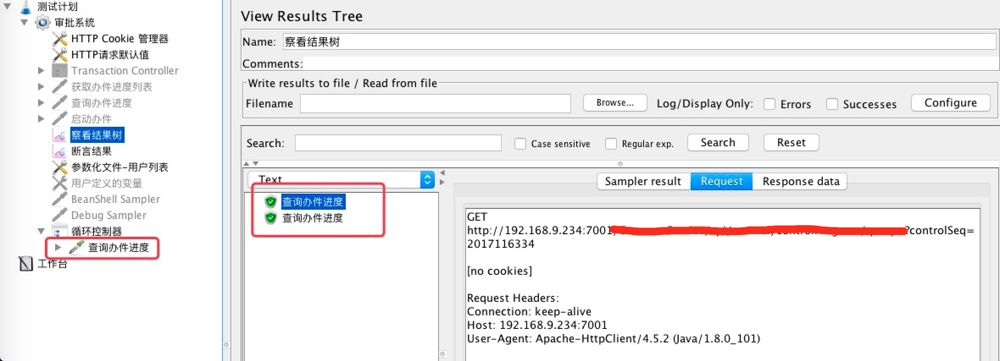

当然，你也可以使用`${parameter}`去获取某一对象的值，你甚至可以使用BeanShell Sampler去动态修改这个值。

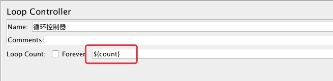

### 2.6 BeanShell

**1. 什么是BeanShell**

BeanShell是一个小巧免费的JAVA源码解释器，具有对象脚本语言特性，亦可嵌入到JAVA源代码中，能动态执行JAVA源代码并为其扩展了脚本语言的一些特性，像JavaScript和perl那样的弱类型、命令式、闭包函数等等特性。

**2. BeanShell在JMeter中的使用**

BeanShell是最高级的JMeter内置组件之一。它支持Java语法，并使用诸如宽松类型，命令和方法闭包之类的脚本特性来扩展它。如果你的测试用例不常见，通过JMeter提供的组件来实现变得棘手或者甚至不可能，比如说加密解密。此时，BeanShell能实现你的目标。

JMeter中的BeanShell实例可以访问JMeter的API和加载到JMeter类路径中的任何外部类（被引用的jar包需放到JMeter安装目录/lib/ext文件夹中，并在BeanShell脚本编写中使用"import"引入被使用的类）。

JMeter提供了以下启用BeanShell的组件

- BeanShell Sampler：一个独立的采样器
- BeanShell PreProcessor：在采样器之前执行的另一个采样器的预处理器，可以用于先决条件设置（即生成一些输入）。
- BeanShell PostProcessor：在采样器之后执行的后处理器，可以用于恢复或清除。
- BeanShell Assertion：一个可以访问JMeter API的高级断言。
- BeanShell Listener
- BeanShell Timer

以上所有JMeter提供的BeanShell组件都有一个共同点就是支持我们使用Java代码去实现更复杂的功能或者去拓展更多的功能，只不过JMeter把这些组件放在不同的位置，这些"不同的位置"最显著的影响就是一个执行顺序问题。

比如，BeanShell PreProcessor这个组件会在接口调用前被执行。在实际生产中，开发人员常会考虑安全问题，对数据进行加密传输，由后台对加密的数据进行解密。对于这样的接口，如果你的参数是使用明文发送，恐怕你怎么调用都无法得到正确的返回值。BeanShell PreProcessor能帮你解决这类问题。

又如，BeanShell PostProcessor，这个组件的设计是在接口调用后执行。对应上面提到的BeanShell前置处理器，这个组件可以用来对返回的加密数据进行解密。或者你可以做一些日志管理之类的事情。

其他的BeanShell组件可自行类推，这里就不再一一举例子说明。使用BeanShell你可以在运行时改变JMeter变量的值，在线程组之间传递Cookie，在发生故障时停止运行测试等等牛逼的事情。

***3.  JMeter内置变量**

- SampleResult
- ResponseCode
- ResponseMessage
- IsSuccess
- Label
- FileName
- ctx
- vars
- props
- log

**SampleResult**

映射JMeter类org.apache.jmeter.samplers.SampleResult。

示例代码：

```java
import org.apache.jmeter.samplers.SampleResult;

String sampleName = SampleResult.getSampleLabel();

log.info("sampleName==>"+sampleName);
```

**ResponseCode**

ResponseCode是一个java.lang.String，表示采样器的响应码，即可以通过该参数动态修改响应码。

示例代码：

```java
if(condition){
	ResponseCode="200";
}else{
	ResponseCode="500";
}
```

**ResponseMessage**

ResponseMessage是一个java.lang.String，表示响应消息。

示例代码：

```java
ResponseMessage="Failure";
```

**IsSuccess**

IsSuccess是一个反映采样器是否成功的java.lang.Boolean。如果设置为true，则采样器被认为是"通过"，否则，则为"失败"。

**Label**

Label是一个java.lang.String，它是用于表示采样器的标签。它可以获取或设置为通常的字符串，并将作为采样器标签列在测试结果中。

**FileName**

FileName是一个java.lang.String，它包含一个BeanShell脚本文件名（在BeanShell采样器的"脚本文件"节中输入的）。

**ctx**

ctx是JMeter内置变量中最强大的变量。它代表org.apache.jmeter.threads.JMeterContext类，实际就是JMeter本身。它提供对采样器、执行结果、变量/属性等的读写。

示例代码：

```java
import org.apache.jmeter.samplers.SampleResult; 
import org.apache.jmeter.threads.JMeterContext;

SampleResult result = ctx.getPreviousResult();

String name = result.getSampleLabel();
String url = result.getUrlAsString();

log.info("result name==>"+name);
log.info("current url==>"+url);
```

**vars**

vars是最常用的JMeter变量，它是org.apache.jmeter.threads.JMeterVariables类的实例，提供对当前变量的读写。所有的JMeter变量都是java字符串，如果你需要把一些变量存放到一个JMeter变量中，需要先把它转换成字符串。

示例代码：

```java
import org.apache.jmeter.threads.JMeterVariables;

vars.put("count","3");

vars.remove("count");
```

**props**

props是java.util.Properties的实例，与vars作用大致相同，区别的是vars是对变量进行读写操作，而props主要是对属性进行读写操作。

示例代码：

```java
import java.util.Properties;

props.get("START.HMS");
```

**log**

log表示org.apache.log.Logger类。

示例代码：

```java
log.info("Hello JMeter");
```

### 2.7 JMeter调试

**正则表达式调试功能**

JMeter提供调试正则表达式的功能。当你不确定正则表达式是否正确时，可以使用`RegExp Tester`，它为测试程序节省了大量的时间，并使得调试更容易，因此你不需要通过多次运行来检测正则表达式的正确性。

创建一个Http请求，点击运行按钮，回到察看结果树界面。如下图所示，选择响应数据，在Search框可以输入我们要查找的东西，检查是否包含在返回内容中。

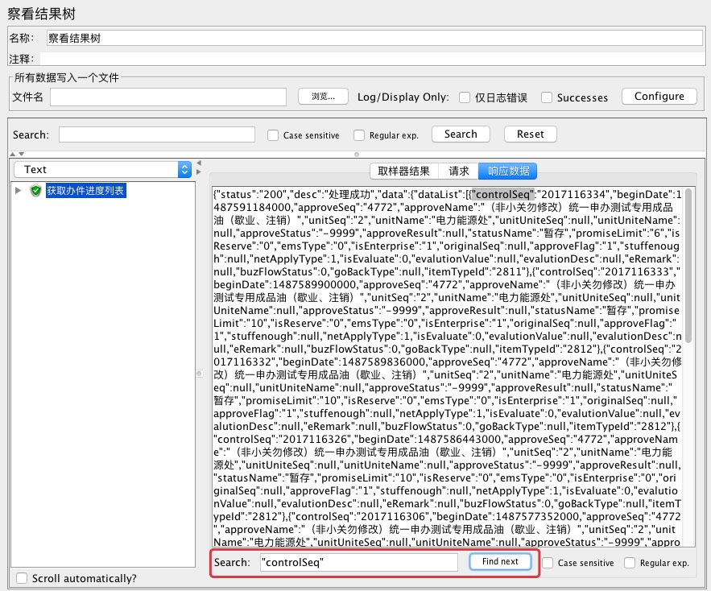

从左边下拉列表中选择`RegExp Tester`，如下图所示：

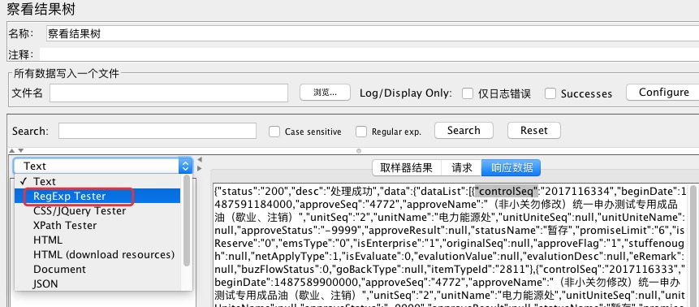

在`Regular expression`中输入我们要检验的正则表达式后点击Test按钮，下面的面板会根据输入的正则表达式输出最终查找结果。如下图所示：

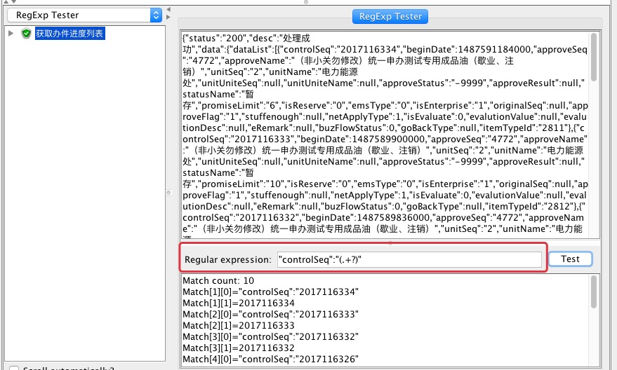

**Sampler调试功能**

JMeter的调试功能并不是你想象中像常见IDE那么强大，可以一行一行代码检测。JMeter的调试更多是通过查看最后的输出信息来查找问题所在。

使用DebugSampler和Debug PostProcessor能帮助你定位问题。当运行完毕后，打开『察看结果树』并选择相应的调试采样器，你将看到执行后输出的一系列信息，这些信息能帮助你找出实际问题。

如下图所示，我们可以通过Debug PostProcessor查看到正则表达式匹配的结果：

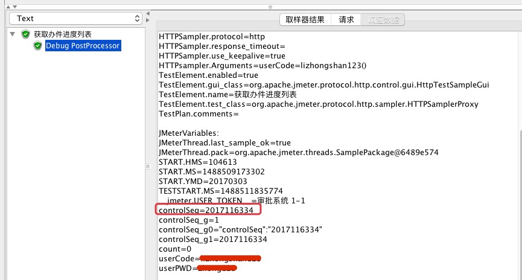

如果是报错信息，我们同样可以通过点击右上角圈出的图标打开log输出信息，如下图所示我们能查看到报错信息。

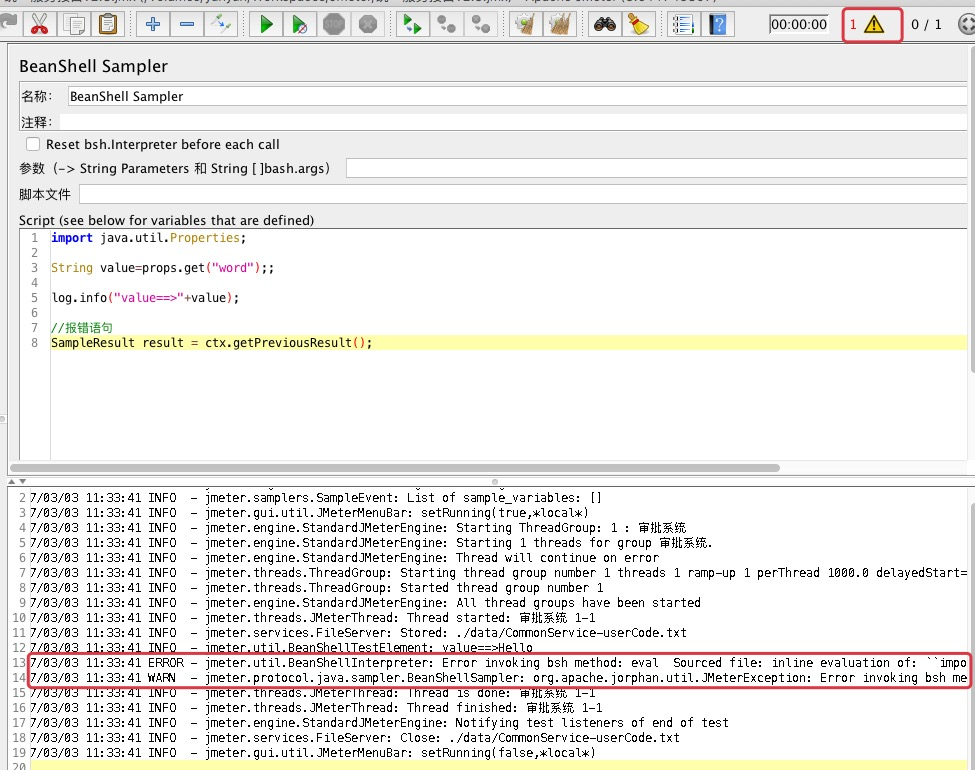

**其他调试功能**

JMeter还有其他方面的调试功能，比如调试CSS/JQuery、调试XPath、调试JMeter元素、远程JMeter调试等等。这里只介绍常用的这两种调试技巧，其他调试功能请自行拓展学习。


## 资料

- Apache JMeter官方文档：[http://jmeter.apache.org/usermanual/component_reference.html](http://jmeter.apache.org/usermanual/component_reference.html)
- Jmeter之逻辑控制器：[http://www.cnblogs.com/ShadowXie/p/6016000.html](http://www.cnblogs.com/ShadowXie/p/6016000.html)
- BeanShell Home：[http://www.beanshell.org/home.html](http://www.beanshell.org/home.html)
- JMeter's Favorite Built-in Component：[https://www.blazemeter.com/blog/queen-jmeters-built-componentshow-use-beanshell](https://www.blazemeter.com/blog/queen-jmeters-built-componentshow-use-beanshell)
- Using Beanshell for Beginners：[https://www.blazemeter.com/blog/using-beanshell-beginners-no-java-knowledge-required](https://www.blazemeter.com/blog/using-beanshell-beginners-no-java-knowledge-required)


