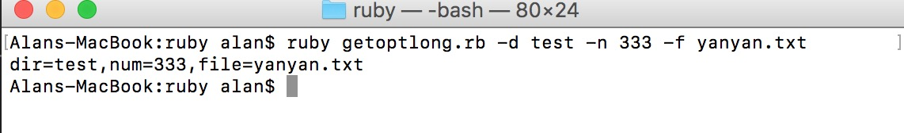

### 1 GetoptLong

GetoptLong主要是用来处理命令行参数。

示例代码：

```ruby
require 'getoptlong'

opts=GetoptLong.new(
	['--dir','-d',GetoptLong::REQUIRED_ARGUMENT],
	['--num','-n',GetoptLong::OPTIONAL_ARGUMENT],
	['--file','-f',GetoptLong::OPTIONAL_ARGUMENT]
)

dir="tmp"
num=10
test_file="test.txt"

def display_usage
	p "Sample usage:"
	p "ruby getoptlong.rb -d tmp -n 3 -f 'test.txt'"
end

#parse arguments
opts.each do |opt,arg|
	case opt
	when '--dir'
		dir=arg
	when '--num'
		num=arg.to_i
	when '--file'
		test_file=arg
	end
end
	
# print all the arguments
puts "dir=#{dir},num=#{num},file=#{test_file}"
```

命令行调用：

```ruby
ruby getoptlong.rb -d test -n 333 -f yanyan.txt
```

执行结果：




