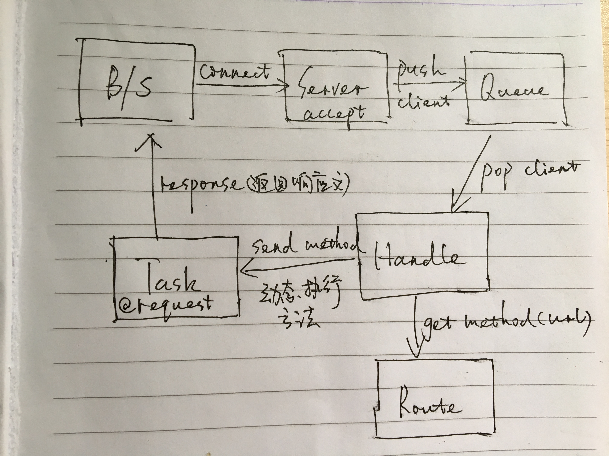

### 1 引言

经过了一周的ruby学习后，为了让ruby基础得到巩固，我用socket写了一个处理http请求的gem包，我也不知道是否已经有大神完成类似功能的gem包，也不清楚我写的这个服务有什么实际的作用，但这个项目只是作为练手。

首先要吐槽一下的是，这个项目虽然代码量不是很多，但是对一个ruby初学者来说，全程用sublime来写还是蛮累的，本来是想用RubyMine的，但是我之前找到的注册码过期了，尽管可以通过调系统时间来解决注册码过期的问题，但是我嫌麻烦，想着就给自己一次锻炼机会吧！结果，说实在的，使用sublime工作效果是比较低的，就说调试程序就是个大问题，不过这也可能是我个人能力问题，不过最终还是学到很多技巧。

用sublime写代码总结的坑如下：

- 使用sublime编写完代码在irb上执行查看结果，若.rb文件未require使用到的类，不提示错误。只有首个rb文件未require会有对应的报错信息，如果是rb文件再引入第二个rb文件，而第二个rb文件没有require对应的类，没有对应的报错信息，坑啊。
- rb文件（非首个rb文件）中类名写错，rescue后报错信息在irb上输出一堆根本定义不到错误内容的信息，甚至错误发生在第几行也是定位不到。我就试过把YNHttp写成YnHttp，结果我花了很长时间在找bug，各种puts信息，血与泪的痛啊。T_T
- 最坑的莫过于sublime不能debug，所以每一次找bug，都要花费我很长时间，不断的做重复工作。
- 执行rb文件也麻烦，每一次都要到终端上cd到要执行的rb文件路径，再进入irb，再load要执行的rb文件，已经练成一手好本领（如何机械的进行工作）。

***本次源代码全部已放在我的Github上，路径：[https://github.com/mia2002/yn_server](https://github.com/mia2002/yn_server)***

### 2 设计思想

我用笔粗略的画了整个逻辑执行过程，如下图所示：



首先，在接收Http请求和处理Http请求应在不同的线程中进行，线程1（接收请求）只负责接收Http请求，并把Http请求存放在队列中，线程2（处理Http请求）负责从队列中拿出请求，并对Http协议进行分析，提取路径和参数，分配到各自的task方法。其实这里就是使用到了生产者消费者模式。

本项目只使用了两条线程，其实更优的处理应该是处理Http请求的线程应根据服务器实际情况分配足够的线程数，并使用线程池管理所有线程，但是本次并没有对此进行优化。

### 3 HTTP协议

这里给网络知识忘记了或者压根就不知道的朋友稍微温习一下：

HTTP是Web浏览器和Web服务器之间通信的标准协议。HTTP指定客户端与服务器如何建立连接、客户端如何从服务器请求数据，服务器如何响应请求，以及最后如何关闭连接。

**每个请求和响应都有同样的基本形式：一个首行、一个包含元数据的HTTP首部，然后是一个消息体。**

**GET请求：**

```
GET /RubyServer/hello?name=yanyan&pwd=123 HTTP/1.1
Host: localhost:9000
User-Agent: Mozilla/5.0 (Macintosh; Intel Mac OS X 10_12_3) 
Accept-Language: zh-cn
Accept-Encoding: gzip, deflate
Connection: keep-alive

```

像这样的GET请求不包含消息体，所以请求以一个空行结束。

第一行称为请求行，包括一个方法（GET/POST）、资源路径以及HTTP版本。

**POST请求**

```
POST /RubyServer/json HTTP/1.1
Host: localhost:3000
Content-Type: application/x-www-form-urlencoded
Connection: keep-alive
Accept: text/html,application/xhtml+xml,application/xml;q=0.9,*/*;q=0.8
User-Agent: Mozilla/5.0 (Macintosh; Intel Mac OS X 10_12_3)
Content-Length: 21

name=yan&password=123
```

在POST请求头中空行后接着是请求主体，Content-Length指明消息体有多少个字节。在处理post请求中一般是根据这个参数来提取主体内容。

那么综上，本次代码就是实现去分析Http请求头，通过第一行能判断我们的请求到底是GET还是POST，如果是GET请求的话，参数是放在资源路径?后面；如果是POST请求，则读取Content-Length的值，并通过该值提取主体内容。

当然，HTTP请求并不只有GET和POST请求，这里我们只处理这两种情况，有兴趣的童鞋可以去拓展一下。

### 4 代码分析

经过简单的HTTP知识温习后，相信接下来的代码分析应该很好理解。

**1.yn\_socket\_queue.rb**

这个类目前的设计只是简单封装了一下，为以后的功能拓展做准备。

```ruby
class YNSocketQueue

	def initialize()
		@queue=Queue.new
	end

	def push(socket)
		raise "Illegal Argument, must be a TCPSocket Object!!" unless socket.is_a? TCPSocket
		if socket != nil
			@queue << socket
		end
	end

	def take
		@queue.pop
	end
end
```

**2.yn\_request.rb**

此类实现将获取到的请求参数由"name=yan&password=123"转换为Hash，我也不清楚ruby的API到底有没有这个功能的实现，我是找遍了String类、Array类和Hash类，都没发现有类似的功能，于是就自己实现。

通过`Request.new.get(key)`可以实现根据参数名称获取参数的值

```ruby
class YNRequest

	include Enumerable

	attr_reader :hash

	def initialize(content="")
		@hash = Hash.new
		if content != ""
			_arr = []
			_arr = content.include?("&") ? content.split("&") : _arr.push(content)
			_arr.each do |e|
				__arr = e.split("=")
				@hash[__arr[0].to_sym]=__arr[1]
			end
		end		
	end

	def get(key)
		@hash[key.to_sym]
	end

	def each
		raise 'please provide a block!' unless block_given?
		@hash.each do |e|
			yield e
		end
	end
end
```

**3.yn\_http.rb**

此类的设计主要是用来返回Http响应文。

```ruby
class YNHttp

	def initialize(_status=200,_server="Apache-Coyote/1.1",_pragma="no-cache",_control="no-cache",_content_type="text/json",_charset="UTF-8",_body="")
		@status = _status
		@server = _server
		@pragma = _pragma
		@cache_control = _control
		@content_type = _content_type
		@charset = _charset
		@body = _body
		@content_length = _body.length
	end

	@@status_hash={
		100 => "CONTINUE",
		200 => "OK",
		201 => "CREATED",
		202 => "ACCEPTED",
		204 => "NO CONTENT",
		302 => "MOVED TEMPORARILY",
		400 => "BAD REQUEST",
		401 => "UNAUTHORIZED",
		402 => "PAYMENT REQUIRED",
		403 => "FORBIDDEN",
		404 => "NOT FOUND",
		408 => "REQUEST TIMEOUT",
		409 => "CONFLICT",
		410 => "GONE",
		500 => "INTERNAL SERVER ERROR"
	}

	def status=(_status)
		@status=_status
	end

	def server=(_server)
		@server=_server
	end

	def pragma=(_pragma)
		@pragma=_pragma
	end

	def cache_control=(_control)
		@cache_control=_control
	end

	def content_type=(_content_type)
		@content_type=_content_type
	end

	def charset=(_charset)
		@charset=_charset
	end

	def body=(result)
		@content_length=result.size
		@body=result
	end

	def response
		"HTTP/1.1 #{@status} #{@@status_hash[@status]}\r\n" +
		"Server:#{@server}\r\n" + 
		"Pragma:#{@pragma}\r\n" + 
		"Cache-Control:#{@cache_control}\r\n" + 
		"Content-Type:#{@content_type};charset=#{@charset}\r\n" + 
		"Content-Length:#{@content_length}\r\n" + 
		"\r\n" + 
		"#{@body}"
	end
end
```

**4.yn\_route\_util.rb**

这个工具类主要是用来配置请求的资源路径对应Task中的方法名，HandlerRequest根据拿到的方法名动态执行Task中的方法。一开始我是考虑使用责任链来实现的，后面发现ruby有send这个方法可以动态执行类定义的方法，果断使用send来实现。

另外，本来原先设计是准备使用properties文件的，但是用gemspec打包后，不知道打包的properties文件到底被存放在什么路径下，试了好几个路径，都是提示file not found，知道怎么回事的大神们可以在评论或者发邮件告诉我，感激不尽！

```ruby
# require 'yaml'

class YNRouteUtil

	include Enumerable

	@@route_hash = {
		"/RubyServer/hello" => "say_hello",
		"/RubyServer/json" => "test_json",
	}

	
	# def initialize
	# 	@route_hash = Hash.new
	# 	puts "route util initialize"
	# 	_arr = YAML.load_file('route.properties').split(" ")
	# 	puts "route_file: #{_arr}"
	# 	_arr.each do |e|
	# 		__arr = e.split("=")
	# 		@route_hash[__arr[0]] = __arr[1]
	# 	end

	# end

	def get_method(route)
		@@route_hash[route]
	end

	def each
		raise 'please provide a block!' unless block_given?
		@@route_hash.each do |e|
			yield e
		end
	end

end
```

**5.yn\_task.rb**

这个类主要作用是用来处理请求的，本示例代码只提供了两个测试方法和一个默认方法，分别是say\_hello（请求路径：/RubyServer/hello将执行该方法）、test\_json（请求路径：/RubyServer/json将执行该方法）和default（请求路径找不到时执行该方法）。

以下这些方法对应的请求路径均在YNRouteUtil这个类中进行配置请求路径以及对应的YNTask类中的方法名，并在YNTask中添加该方法，实现对请求的处理，通过`@request.get(key)`可以实现根据接口定义的参数名称来获取参数的值，`YNHttp.new.body="json string"`返回处理后的json数据，最后，切记一定要返回最终的请求响应文，如test_json最后的`http.response`

```ruby
require 'json'
require 'yn_http'
require 'yn_request'

class YNTask
	def initialize(request)
		@request = request
	end

	def method_missing(method_name)
		puts "#{method_name} not found in YNTask,please check yn_route_uril.rb"
		default
	end

	# route: /RubyServer/hello
	def say_hello
		begin
		http = YNHttp.new
		http.content_type = "text/html"
		_param = ""
		@request.each do |e|
			_param+="#{e[0]}=#{e[1]}<br>"
		end
		
		http.body = "<html><head><title>Hello to Ruby Server</title></html><body><h1>Hi,welcome to Yan's ruby server!</h1><p>the request param:<br>#{_param}</p></body></html>"
		# return the response result
		http.response
		rescue Exception => e
			puts e.send(:caller)
		end
		
	end

	# route: /RubyServer/json
	def test_json
		http = YNHttp.new
		http.content_type = "text/json"
		result = JSON.generate(@request.hash)
		http.body = result
		http.response # 最后必须返回影响文
	end

	# url not found
	def default
		http = YNHttp.new
		http.content_type = "text/html"
		http.status = 404
		http.body = "<html><head><title>Welcome</title></html><body><h1>Welcome to Yan's ruby server!</h1><p><h3>404 Not Found</h3></p></body></html>"
		http.response # 最后必须返回影响文
	end
end
```

**6.yn\_socket\_server.rb**

该类主要实现开启一个TCPServer服务，接收http请求，并将接收到的请求push到队列中。

```ruby
require 'socket'
require 'yn_socket_queue'
require 'yn_handle_request'

class YNSocketServer

	# 初始化
	# port 端口号
	def initialize(port,queue)
		@port = port
		@queue = queue
	end

	def start_server
		begin
			@server=TCPServer.open(@port)
			puts "start successfully!!"
			loop{
				@client=@server.accept
				@queue.push(@client)
			}
		rescue Exception => e
			puts e.send(:caller)
		end
		
	end
end
```

**7.yn\_handle\_request.rb**

该类是做处理Http请求，是最最核心的类，也是业务逻辑最复杂的类。

它主要做的处理有如下：

- 分析HTTP请求头
- 根据资源路径查找YNTask中的方法名
- 动态执行YNTask类中的方法，获取最终的响应文
- 返回响应文给请求客户端

```ruby

require 'yn_socket_queue'
require 'yn_request'
require 'yn_task'
require 'yn_route_util'

# 处理http请求
# create by yan
class YNHandleRequest

	def initialize(socket_queue)
		@socket_queue=socket_queue
	end

	def handle
		loop do
			begin
				client = @socket_queue.take
				puts "-----------------------------------"
				_method,path = client.gets.split
				puts "url: #{path}"
				puts "method: #{_method}"
				headers={}
				while line = client.gets.split(' ',2)
					break if line[0]==""
					headers[line[0].chop] = line[1].strip
				end
				data = ""
				servlet_url = ""
				if _method.upcase == 'POST'
					data = client.read(headers["Content-Length"].to_i)
					servlet_url = path
				elsif _method.upcase == 'GET'
					if path.include? '?'
						# 带参数
						data = path[(path.index('?')+1)..path.length]
						servlet_url = path[0...path.index('?')]
					else
						data = ""
						servlet_url = path
					end
				end
				request = YNRequest.new(data)
				puts "parameter: #{request.hash}"
				util = YNRouteUtil.new
				route = util.get_method(servlet_url)
				task = YNTask.new(request)
				route = "default" if route == nil || route.empty?
				puts "route: #{route}"
				_result = task.send(route) #动态执行方法
				client.write(_result)
			
			rescue Exception => e
				puts e.send(:caller)
			ensure
				client.close
			end
			
		end
	end
end
```

最后，我们可以分别开启两条线程来执行代码，一条线程主要用来负责接收Http请求，另外一条线程用来处理Http请求。

### 5 GEM打包

1.创建与项目同名的.gemspec文件，本例为：yn_server.gemspec，其实不同名也可以，但是为了便于管理，推荐还是建同名文件会比较好。

在.gemspec文件中写入如下内容：

```ruby
Gem::Specification.new do |s|  
  s.name        = 'yn_server'  
  s.version     = '0.1'  
  s.date        = '2017-03-23'  
  s.summary     = 'Ruby Server!'
  s.description = 'A simple socket server gem'
  s.authors     = ['Yan Ng']  
  s.email       = 'yan@yerl.cn'  
  s.files       = %w(
                        lib/yn_handle_request.rb
                        lib/yn_http.rb
                        lib/yn_server.rb
                        lib/yn_request.rb
                        lib/yn_route_util.rb
                        lib/yn_socket_queue.rb
                        lib/yn_socket_server.rb
                        lib/yn_task.rb
                    )
  s.homepage    =  
    'http://rubygems.org/gems/yn_server'  
  s.license     = 'MIT'
end  
```

注意，s.name一定要是执行的第一个rb文件名称，在打包的rb文件一定要有和该名字一样的ruby文件，否则，最终安装后，require我们这个name，系统会报找不到文件。我就被坑过，最后还是谷歌出来的。

2.生成gem包

在终端执行gem build后会在当前路径生成gem包。

```ruby
gem build yn_server.gemspec
```

3.install gem

生成的gem包可以实现在本地安装，使用gem install命令

```ruby
sudo gem install yn_manage-0.1.gem 
```

通过gem list命令可以查看是否已经安装成功。

4.irb导入自己的gem包

通过gem install后我们就不需要再向从前那样使用load .rb文件，可以直接使用require引入要使用的类。

示例代码：

```ruby
# 'yn_server'为gemspec中的s.name所配置的名称
require 'yn_server' 
```

5.发布gem包


### 6 心得体会

虽说我对Ruby还有很多不懂的地方，但是作为一个新手来说，我坚持完成了一个简单的ruby项目编写，这当中我也学习到很多东西，也发现自己越来越习惯看英文文档，喜欢用Google而不用百度，百度已经越来越不能满足我的需求了。当然这可能也是因为国内的Ruby并没有像国外那么流行，不仅Ruby如此，连自动化测试也是，都是要通过查阅国外文档才能找到答案。

学习完Ruby后，我感觉在移动自动化测试上可以用上，以后在学习移动自动化测试可以开发自己的gem包，还是很不错的想法。

Ruby on Rails，我想在未来有时间再继续深入学习ruby。


>e-mail：yan@yerl.cn

>blog：mia2002.cn


