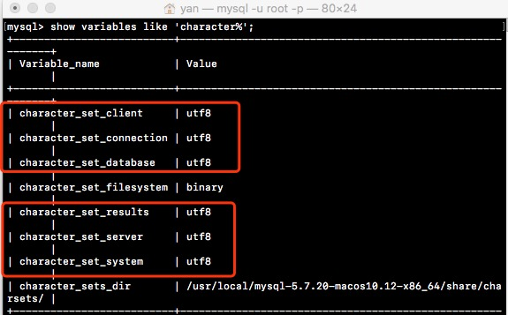
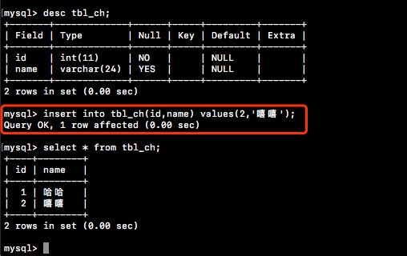

## 官网下载MySQL

下载连接：[https://dev.mysql.com/downloads/mysql/](https://dev.mysql.com/downloads/mysql/)


## 安装MySQL

下载完毕后直接双击安装即可。安装最后记得截图保存初始密码。


## 查看安装结果

在系统偏好设置中可以查看MySQL是否已被安装上。


双击，打开MySQL Server。


## 配置环境变量

初次安装MySQL，在终端输入命令，`mysql`会提示命令找不到，需要配置一下环境变量。

可以先查看/usr/local是否有mysql这个文件目录。


执行命令nano或者vim修改`bash_profile`文件添加mysql bin文件的路径。


保存，执行命令`source ~/.bash_profile`。

## 修改初始密码

执行命令`mysqladmin -u root -p password yournewpass`
输出刚刚截图保存的初始化密码，即可完成密码修改，`yournewpass`就是修改后的密码。


## 登录MySQL

执行命令`mysql -u root -p`，输入修改后的密码，即可登录。
注意另起一个窗口。


## 使用命令创建表

登录MySQL后即可使用命令创建数据库，数据表，插入数据等增删改查操作。

**创建数据库**

```
create database [name]
```

**使用数据库**

```
use [name]
```

**创建数据表**

```
create table tbl_test(
id int not null,
name varchar(64) not null
);
```

**插入数据**

```
insert into tbl_test(id,name) values(1,'yanyan');
```

## 中文字符串插入问题

MySQL默认是使用latin1编码，他有另外一个我们大家都很熟悉的名称，叫ISO-8859-1，做过后台开发的人都知道，当网页编码为ISO-8859-1时，是不能输入中文字符串的。

查看MySQL编码，执行命令`show variables like 'char%'`。



注意：除了character\_set\_filesystem 和 character_sets_dir ，其它圈出来的几个编码均要修改为utf8。

同样，在MySQL中，如果没有设置编码的话，是输入不了中文字符串的。找到MySQL安装目录下的**my.cnf**或者**my.ini**，添加或者修改以下内容：

```
[mysqld]
character-set-server=utf8

[client]
default-character-set=utf8
```

MacOs的用户如果找不到**my.cnf**文件，可以在`/etc`下新建**my.cnf**文件，并写入如上内容，保存即可。

保存完毕后，最好重新打开终端登录MySQL，不重新打开其实也可以，不过为了避免一些不必要的异常，建议还是另起一个命令行窗口登录MySQL。

再次执行`show variables like 'char%'`查看是否已修改成功。

修改完毕，注意数据库也要重新创建，否则你会发现还是不能输入中文，我一开始就在这个地方卡了很久，我想已经创建了的数据库还是沿用之前的编码，你也可以通过修改原有的数据库编码。

另外，如果你不嫌麻烦的话，也可以在每一次创建表的时候带上编码的声明，如果是这种声明方式的话，即使不修改MySQL的默认编码，也是可以实现中文输入的。如下例子：

```
create table tbl_ch(
id int not null,
name charchar(64) character set gbk);
```

最后，执行结果如下：




