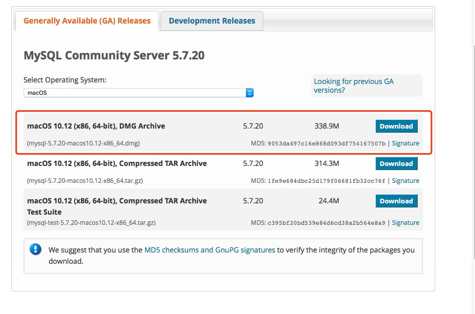
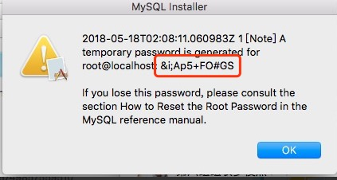
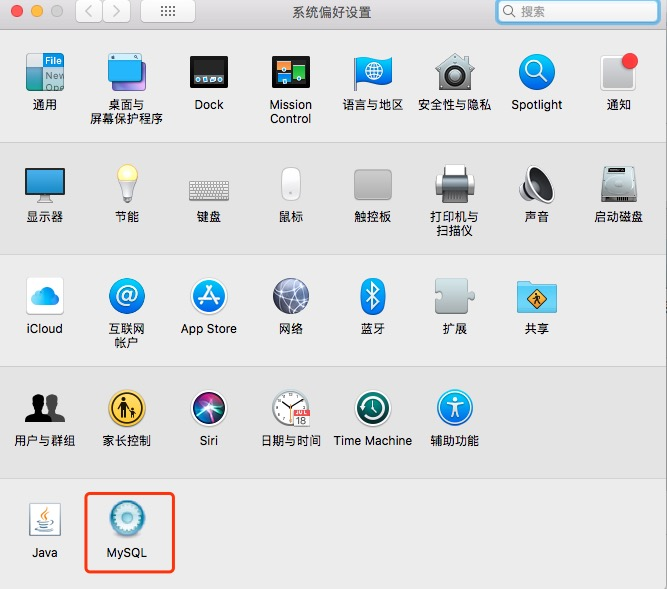
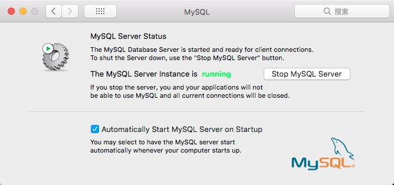
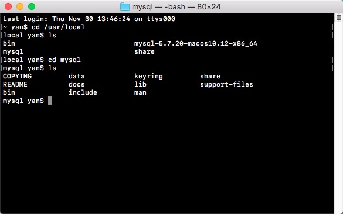
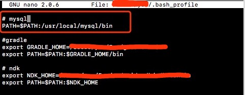
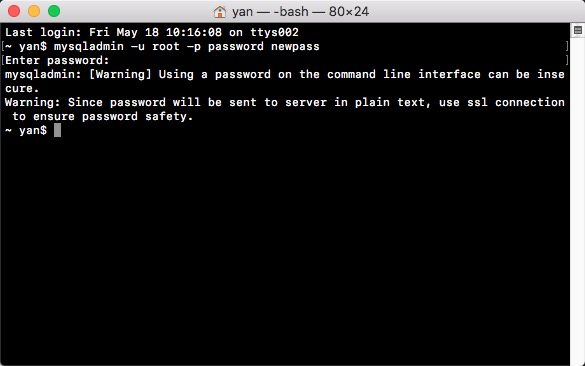
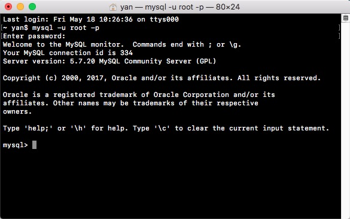

## 官网下载MySQL

下载连接：[https://dev.mysql.com/downloads/mysql/](https://dev.mysql.com/downloads/mysql/)



## 安装MySQL

下载完毕后直接双击安装即可。安装最后记得截图保存初始密码。


## 查看安装结果

在系统偏好设置中可以查看MySQL是否已被安装上。



双击，打开MySQL Server。



## 配置环境变量

初次安装MySQL，在终端输入命令，`mysql`会提示命令找不到，需要配置一下环境变量。

可以先查看/usr/local是否有mysql这个文件目录。



执行命令nano或者vim修改`bash_profile`文件添加mysql bin文件的路径。



保存，执行命令`source ~/.bash_profile`。

## 修改初始密码

执行命令`mysqladmin -u root -p password yournewpass`
输出刚刚截图保存的初始化密码，即可完成密码修改，`yournewpass`就是修改后的密码。



## 登录MySQL

执行命令`mysql -u root -p`，输入修改后的密码，即可登录。
注意另起一个窗口。




## 使用命令创建表

登录MySQL后即可使用命令创建数据库，数据表，插入数据等增删改查操作。

**创建数据库**

```
create database [name]
```

**使用数据库**

```
use [name]
```

**创建数据表**

```
create table tbl_test(
id int not null,
name varchar(64) not null
);
```

**插入数据**

```
insert into tbl_test(id,name) values(1,'yanyan');
```


