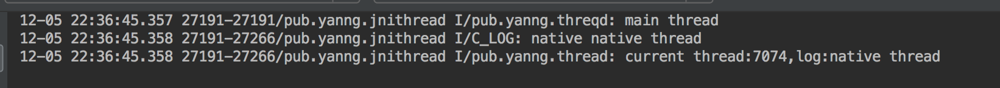
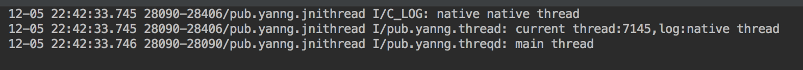

## 概述

线程是让单个进程并发执行多个任务的机制。它是共享同一个父进程的内存和资源的轻量级进程，一个进程可以包括多个并行执行的线程。作为同一个进程的一部分，线程之间可以批次通信并共享数据。Android支持java和原生代码中的线程。

## pthread_create

Android创建线程支持两种方式，一种是我们都很熟悉的java线程，可以直接在java线程中直接执行原生代码。

另外一种就是原生线程POSIX线程。

POSIX线程也被简称为Pthreads，是一个线程的POSIX标准。

头文件：

```c
#include <pthread.h>
```

创建线程

```c
int pthread_create(pthread_t* thread,
pthread_attr_t const* attr,
void* (*start_routine)(void*), 
void* arg);
```

函数参数说明如下：

- 指向pthread_t 类型变量的指针，函数用该指针返回新线程的句柄。
- 指向pthread_attr_t 结构的指针形式存在的新线程属性，可以通过该属性指定新线程的栈基址、栈大小、守护大小、调度策略和调度优先级等。
- 指向线程启动程序的函数指针，启动线程函数签名格式如下：
	void* start_tountine (void* args)，启动程序将线程参数看成是void指针，返回void指针类型结果。
	
当线程以空指针的形式执行时，参数都需要被传递给启动程序，如果不需要传递参数，它可以为NULL。

成功时，pthread_create函数返回0，否则返回一个错误代码。

```c
pthread_t thread;
const char *message = "native thread";

int result = pthread_create(&thread,NULL,nativeThread,(void*) message);
if (0 != result){
	//获取异常类
   jclass exceptionClazz = env->FindClass("java/lang/RuntimeException");
	//抛出异常
	env->ThrowNew(exceptionClazz, "无法创建线程");
}
```

示例代码：

```c
static void* printInfo(void* args){
	char *message;
	message = (char*)args;
	printf("%s \n",message);
}

int main(){
	pthread_t thread;
	const char* message = "native thread";
	int result;
	result = pthread_create(&thread,NULL,printInfo,(void*) message);
	if(0 != result){
		printf("ERROR -- pthread_create return code: %d\n",result);
	}
}
```

## pthread_join

通过pthread_join函数可以使一个函数等待线程终止。

```c
int pthread_join(pthread_t thread,void** ret_val);
```

函数参数说明如下：

- 线程句柄，它是pthread_create函数返回的目标线程。
- 指向空指针的指针，该指针是为了从启动程序中获得返回值。

执行pthread_join，将挂起调用线程的执行，直到目标线程终止。如果ret_val不是NULL，该函数将ret_val指针的值设置为启动程序的返回结果。如果成功，pthread_join函数返回值是0，否则它将返回错误代码。

示例代码：

```c
//使用pthread_create所创建的目标线程thread
void* value = NULL;
if(0 != pthread_join(thread,&value)){
	printf("ERROR -- unable to join thread. \n");
}else{
	printf("join thread returned %d. \n",value);
}
```

## 附到Java虚拟机

创建的线程需要依附到java虚拟机上，通过JNI_OnLoad()可以得到指向java虚拟机的指针JavaVM* ，通过JavaVM* 的AttachCurrentThread()函数依附到java虚拟机上。

```c
//Java虚拟机接口指针
static JavaVM* gVm = NULL;

/**
 * 使用JNI_OnLoad方法可以获取Java虚拟机接口指针。
 * 当共享库开始加载时虚拟机会自动调用该方法。
 * @param vm
 * @param reserved
 * @return
 */
jint JNI_OnLoad(JavaVM* vm,void* reserved){
    //缓存Java虚拟机接口指针
    gVm = vm;

    return JNI_VERSION_1_4;
}
```

```c
static void* nativeThread(void* args){
    JNIEnv* env = NULL;
    //将当前线程附加到Java虚拟机上
    //并且获取JNIEnv接口指针
    if (0 == gVm->AttachCurrentThread(&env,NULL)){
    	...
    
		//从Java虚拟机中分离当前线程
		gVm->DetachCurrentThread();
	}
	return (void*) 1;
}
```

## Android例子

本例子实现三个native方法，分别是创建POSIX线程方法、初始化方法和释放内存方法。声明如下：

```java
//在Activity的onCreate()方法调用，主要用于native全局变量初始化之类的。
public native void nativeInit();

//在Activity按钮点击调用，主要用于创建native线程。
public native void posixThread();

//在Activity的onDestroy()方法调用，主要用于native释放内存
public native void nativeFree();
```

native回调方法，在Activity中声明如下方法：

```java
public void onNativeResult(final String log){
	//native创建线程成功后会回调此方法
}
```

native方法实现：

**nativeInit()方法代码实现：**

```c
static jobject gObj = NULL;

//缓存回调方法的methodID
static jmethodID gOnNativeResult = NULL;

JNIEXPORT void JNICALL
Java_pub_yanng_jnithread_MainActivity_nativeInit(JNIEnv *env, jobject instance) {
	//如果全局对象为空，则初始化
	if (NULL == gObj){
		//为对象创建一个新的全局引用
		gObj = env->NewGlobalRef(instance);
		if (NULL == gObj){
			return;
		}
	}

	//回调方法methodId初始化
	if (NULL == gOnNativeResult){
		//反射
		jclass clazz = env->GetObjectClass(instance);
		gOnNativeResult = env->GetMethodID(clazz,"onNativeResult","(Ljava/lang/String;)V");
		if (NULL == gOnNativeResult){
			//没有声明回调方法
			jclass exceptionClazz = env->FindClass("java/lang/RuntimeException");
			//抛出异常
			env->ThrowNew(exceptionClazz,"没有声明onNativeResult()方法");
			return;
		}
	}
}
```

**nativeFree()方法代码实现：**

```c
JNIEXPORT void JNICALL
Java_pub_yanng_jnithread_MainActivity_nativeFree(JNIEnv *env, jobject instance) {

    if (NULL != gObj){
        //删除引用
        env->DeleteGlobalRef(gObj);
        gObj = NULL;
    }

}
```

**posixThread()方法代码实现：**

```c
static void* nativeThread(void* args){
    JNIEnv* env = NULL;
    if (0 == gVm->AttachCurrentThread(&env,NULL)){
        char* message = (char*) args;
        LOGI("native %s \n",message);
        jstring messageString = env->NewStringUTF(message);
        env->CallVoidMethod(gObj,gOnNativeResult,messageString);
        gVm->DetachCurrentThread();
    }
    return (void*) 1;
}

JNIEXPORT void JNICALL
Java_pub_yanng_jnithread_MainActivity_posixThread(JNIEnv *env, jobject instance) {

    pthread_t thread;
    const char *message = "native thread";

    int result = pthread_create(&thread,NULL,nativeThread,(void*) message);
    if (0 != result){
        //获取异常类
        jclass exceptionClazz = env->FindClass("java/lang/RuntimeException");
        //抛出异常
        env->ThrowNew(exceptionClazz, "无法创建线程");
    }

//pthread_join()示例代码
    void* value = NULL;
    if(0 != pthread_join(thread,&value)){
        //获取异常
        jclass exceptionClazz = env->FindClass("java/lang/RuntimeException");
        //抛出异常
        env->ThrowNew(exceptionClazz,"unable to join thread");
        return;
    }
}
```

注意在ndk忘了多少版本后，使用pthread_create会报too many arguments,expect 1。原因是大概是\_Nonnull找不到宏定义，这个刚开始被坑了很久，最后在stackoverflow找到解决方案。

解决方案：

在c文件的最前，加入以下声明：

```c
#ifndef _Nonnull
#define _Nonnull
#endif
```

app的build.gradle添加如下代码：

```groovy
android {
    ...
    defaultConfig {
        ...
        externalNativeBuild {
            ndkBuild{
                arguments "APP_DEPRECATED_HEADERS=true"
            }
            cmake {
                cppFlags ""
            }
        }
    }
}
```

再Sync Now 后就不报错啦~

运行结果：

当上面注释掉pthread_join的示例代码，运行结果如下：



可以看到日志输出是先输出主线程的Log，再输出native线程的日志，最后是native线程回调方法的日志输出。

再把pthread_join的示例代码打开，再一次运行，运行结果如下：



此时，先输出的是native方法的日志，然后是native线程回调方法的日志输出，最后才是主线程的日志输出。

完整代码：

[https://github.com/mia2002/JniThread](https://github.com/mia2002/JniThread)


