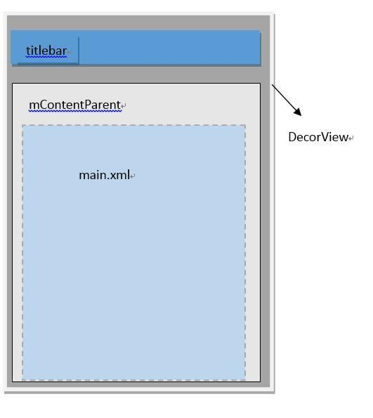
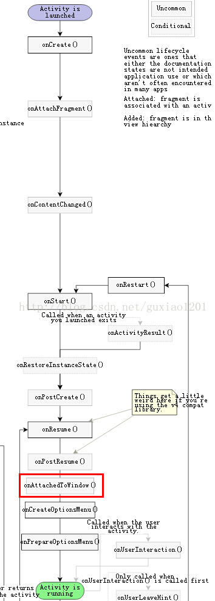

1. DecorView为整个Window界面的最顶层View
2. DecorView只有一个子元素为LinearLayout，代表整个Window界面，包含通知栏，标题栏，内容显示栏三块区域。
3. LinearLayout里有两个FrameLayout子元素。

第3点提到的两个FrameLayout分别为标题栏显示界面和内容栏显示界面。

- 标题栏显示界面：只有一个TextView显示应用的名称。也可以自定义标题栏，载入后的自定义标题栏View将加入FrameLayout中。

- 内容栏显示界面：就是setContentView方法载入的布局界面，加入其中。



**接下来通过代码详细了解一下DecorView**

我们在Activity中，会在onCreate()方法中写下这样一句代码：

```java
//指定Activity的布局
setContentView(R.layout.main)
```

通过跟踪代码可得知Activity#setContentView最终调用的是Window#setContentView。

```java
public void setContentView(@LayoutRes int layoutResId){
    getWindow().setContentView(layoutResID);  //调用getWindow方法，返回mWindow
     initWindowDecorActionBar();
}

public Window getWindow() {   
     return mWindow;
}
```

mWindow是在Activity#attach方法中被赋值：

```java
final void attach(Context context, ActivityThread aThread,
            Instrumentation instr, IBinder token, int ident,
            Application application, Intent intent, ActivityInfo info,
            CharSequence title, Activity parent, String id,
            NonConfigurationInstances lastNonConfigurationInstances,
            Configuration config, String referrer, IVoiceInteractor voiceInteractor) {
        ...
        //mWindow被赋值
        mWindow = new PhoneWindow(this);
        ...
    }
```

从上面的代码可以看出PhoneWindow是Window的实现类，接下来看一下PhoneWindow的setContentView方法：

```java
@Override
public void setContentView(int layoutResID) {
    // Note: FEATURE_CONTENT_TRANSITIONS may be set in the process of installing the window
    // decor, when theme attributes and the like are crystalized. Do not check the feature
    // before this happens.
    if (mContentParent == null) { // 1
        installDecor();
    } else if (!hasFeature(FEATURE_CONTENT_TRANSITIONS)) {
        mContentParent.removeAllViews();
    }

    if (hasFeature(FEATURE_CONTENT_TRANSITIONS)) {
        final Scene newScene = Scene.getSceneForLayout(mContentParent, layoutResID,
                getContext());
        transitionTo(newScene);
    } else {
        mLayoutInflater.inflate(layoutResID, mContentParent); // 2
    }
    final Callback cb = getCallback();
    if (cb != null && !isDestroyed()) {
        cb.onContentChanged();
    }
}
```

其中，mContentParent是一个ViewGroup类型，这个mContentParent是布局（main.xm）的父布局。他是mDecor本身或者它的子元素。

```java
// This is the view in which the window contents are placed. It is either
// mDecor itself, or a child of mDecor where the contents go.
private ViewGroup mContentParent;
```

**创建DecorView**

接下来看一下PhoneWindow#installDecor方法的源码：

```java
private void installDecor() {
    if (mDecor == null) {
        mDecor = generateDecor(); // 1
        mDecor.setDescendantFocusability(ViewGroup.FOCUS_AFTER_DESCENDANTS);
        mDecor.setIsRootNamespace(true);
        if (!mInvalidatePanelMenuPosted && mInvalidatePanelMenuFeatures != 0) {
            mDecor.postOnAnimation(mInvalidatePanelMenuRunnable);
        }
    }
    if (mContentParent == null) {
        mContentParent = generateLayout(mDecor); // 2
        ...
        } 
    }
}

protected DecorView generateDecor() {
    return new DecorView(getContext(), -1);
}
```

从上面的方法可以看出这里实现了一个DecorView，DecorView是PhoneWindow类的一个内部类。

总结：DecorView是ViewTree的最顶层View，他含有两个子元素，包含TitleBar的FrameLayout和包含mContentParent的FrameLayout，当设置了Window.windowNoTitle，DecorView只有mContentParent一个子View。而我们的布局文件（main.xml）就是放在mContentParent里。

**将DecorView添加至Window**


# onAttachedToWindow()

当view和window绑定时会调用这个方法，在onDraw之前调用。

在Android生命周期的位置：

onCreate-->onStart-->onResume-->onAttachedToWindow



