## 环境准备

**Android Studio已安装NDK。**

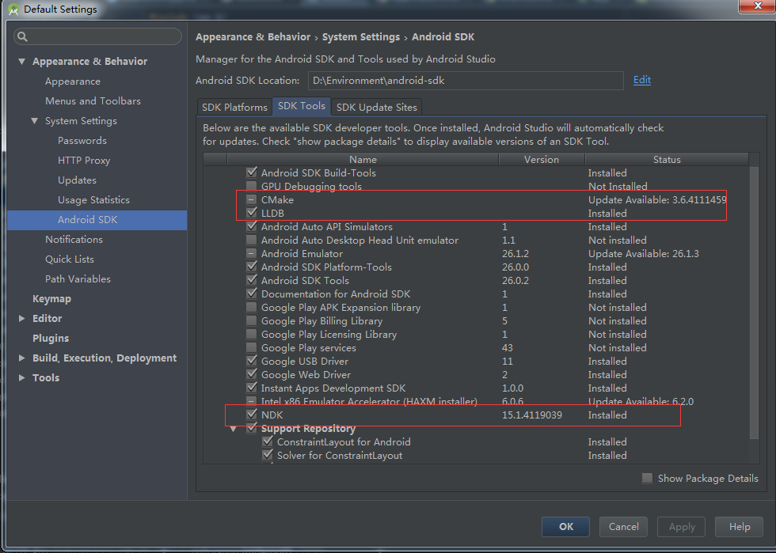

**配置ndk-build的环境变量**

**Windows环境变量配置**

1. 新建系统变量

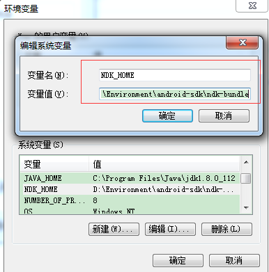

2. 找到Path系统变量，添加 `%NDK_HOME%;`

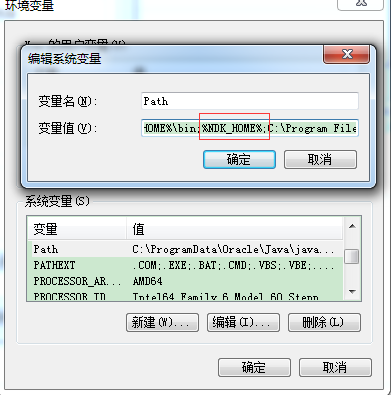

3. 保存，打开cmd终端，输入ndk-build测试

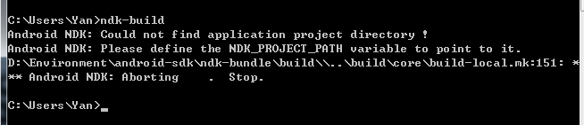

看到如图所示提示，即表示环境变量配置成功。

**Mac环境变量配置**

1. 使用vim或者nano修改~/.bash_profile文件，添加ndk-build路径。

```ruby
nano ~/.bash_profile
```

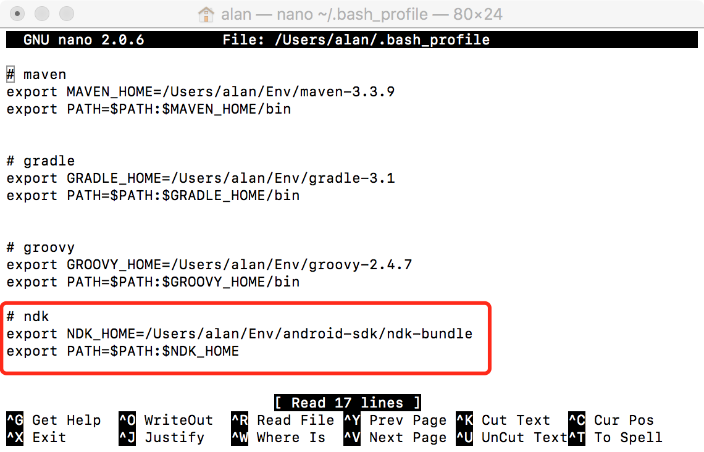

添加完点击control+x保存文件。

2. 使用`source .bash_profile`命令应用刚添加的配置
3. 使用`ndk-build`检测是否已配置成功

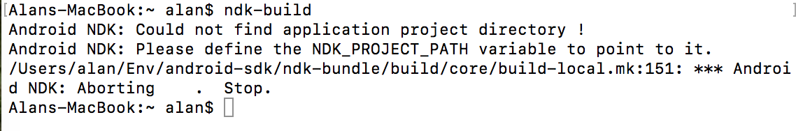

## 添加jni目录

在已创建的Android项目中src/main下面创建jni目录。

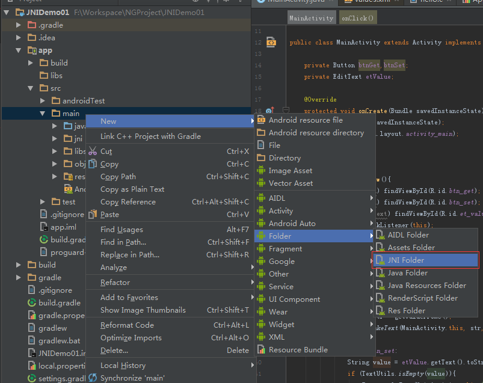

## 声明native方法

使用C/C++语言编写部分的代码，在java中均使用native修饰符修饰。

本demo中，我在MainActivity声明了两个native方法。

示例代码：

```java
public class MainActivity extends Activity{

    @Override
    protected void onCreate(Bundle savedInstanceState) {
        super.onCreate(savedInstanceState);
        setContentView(R.layout.activity_main);
    }

    //从C文件获取值
    public native String getValueFromC();

    //实现将值传递给C
    public native void setValueToC(String value);

}
```

## 生成头文件

jni本地函数命名规则是 `Java_包名_native方法所在的类名_native方法名`，为了因命名错误而导致一些不必要的异常，推荐使用javah命令来生成头文件。

进入项目目录app/src/main/java中，使用以下命令：

```java
javah 包名.MainActivity
```

## 编写C代码

在jni目录下新建.c文件，并将刚刚生成的.h头文件的两个native方法拷贝进来。

```java
#include <stdio.h>
#include <string.h>
#include <jni.h>
#include <android/log.h>

//宏定义，由于C中调用log的函数是__android_log_print()，为了简便，因此使用宏定义

#define  LOG_TAG    "C_LOG"
#define  LOGI(...)  __android_log_print(ANDROID_LOG_INFO, LOG_TAG, __VA_ARGS__)

//第一个参数JNIEnv* JNIEnv是一个结构体，里面定义了大量的函数指针，供开发使用。
//第二个参数是jobject 就是调用当前native方法的Java对象

JNIEXPORT jstring JNICALL Java_pub_yanng_jnidemo01_MainActivity_getValueFromC
  (JNIEnv *env, jobject thiz){
    //在LogCat中输出日志
   LOGI("调用 C getValueFromC() 函数\n");
   char *str = "Hello JNI，I'm from C";
   //通过NewStringUTF函数将C的字符串转换成java的jstring类型。
   return (*env)->NewStringUTF(env,str);
  }

  JNIEXPORT void JNICALL Java_pub_yanng_jnidemo01_MainActivity_setValueToC
    (JNIEnv *env, jobject thiz, jstring str){
    //在LogCat中输出日志
    LOGI("调用 C setValueToC() 函数\n");
    char *string = (char*)(*env)->GetStringUTFChars(env, str, NULL);
     LOGI("您设置的值为：%s\n", string);

      // 显示释放转换成UTf-8的string空间，如果不显示调用，JVM会一直保存该对象，不回收，容易导致内存溢出
      (*env)->ReleaseStringUTFChars(env, str, string);
    }
```

## 新建Android.mk文件

在jni目录中新建名为Android.mk的文件，并在文件中输入如下内容：

```ruby
LOCAL_PATH := $(call my-dir)

include $(CLEAR_VARS)

LOCAL_MODULE    := hello
LOCAL_SRC_FILES := hello.c

# 这句主要是因为使用了Android/log.h，因此需要加上这句
LOCAL_LDLIBS := -llog 

include $(BUILD_SHARED_LIBRARY)
```

## build.gradle

在app的build.gradle添加如图所示圈出来部分内容。

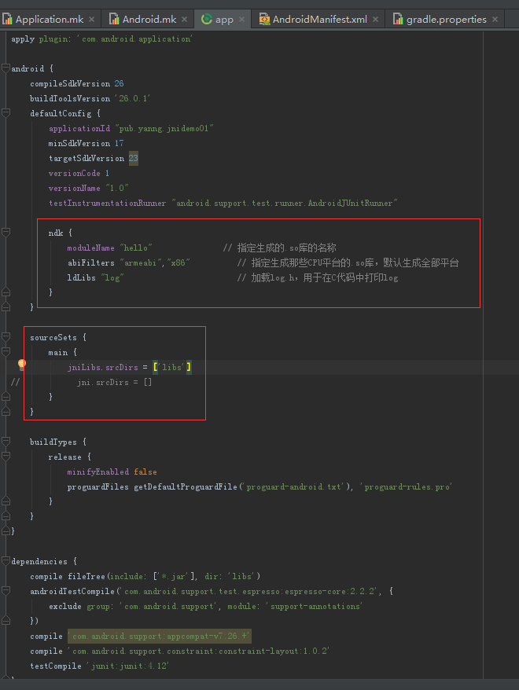

## gradle.properties

为解决ndk提示版本低不能自动编译，可在gradle.properties文件中添加如下语句：

```ruby
android.useDeprecatedNdk=true
```

## 执行ndk-build

打开命令行，cd到jni当前目录所在路径，命令行输入`ndk-build`

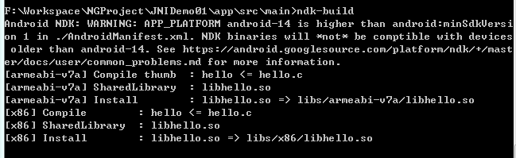

看到没有报错信息，并且提示生成.so文件，并且在项目的libs文件夹中会有生成的so文件，即表示生成.so文件成功。

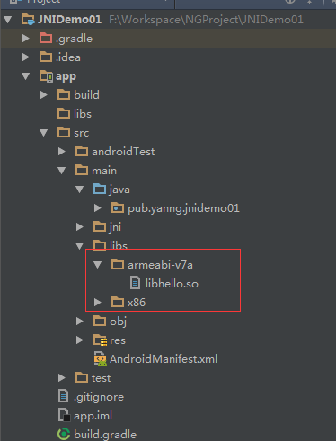

## System.loadLibrary

在java代码中还需要使用`System.loadLibrary`加载so文件，如下代码所示：

```java
static {
    System.loadLibrary("hello");
}
```

其中hello就是Android.mk中定义的名字。

## 执行结果

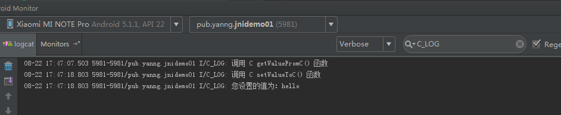


