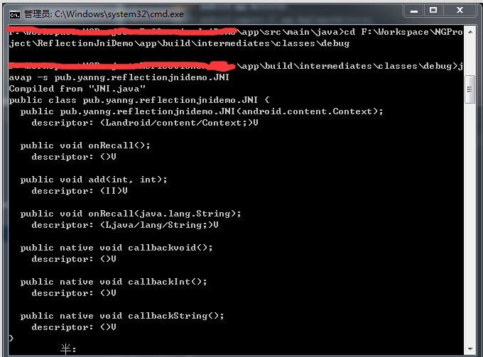

注意：C回调Java方法是通过反射来实现的。

C反射步骤与java反射基本一致。

**Java的反射示例代码：**

```java
//先找到class
Class clazz = Class.forName("package.TestModel");
//找到方法
Method method = clazz.getMethod("methodName",String.class);
//创建对象
//Object obj = clazz.newInstance();//构造方法无参数可使用该方法创建
//获取带参的构造方法
Constructor constructor = clazz.getConstructor(Context.class);
//实例化对象
Object obj = constructor.newInstance(MainActivity.this);
//调用方法
method.invoke(obj,"hello,yanyan!");
```

**C反射**

1. JNI提供了FindClass()、GetObjectClass()等方法供获取Class。
2. 通过GetMethodID()获取要调用的方法
3. 通过AllocObject()创建对象
4. 调用方法

**回调Java无参方法的示例代码:**

java代码：

```java
/**
* 回调方法
*/
public void onRecall(){
    Toast.makeText(context,"我是回调空方法",Toast.LENGTH_SHORT).show();
}
```

C代码：

```java
//找到字节码 findClass第一个参数env 第二个参数 要找的字节码对应类的路径
//jclass  （*FindClass)(JNIEnv*,const char*);
jclass clazz = (*env)->FindClass(env,"pub/yanng/reflectionjnidemo/JNI");
//找到方法
//第二个参数是找到的字节码(class)
//第三个参数是要回调的方法名，第四个参数是方法签名，可通过javap获取方法签名（详细操作下面有介绍）
jmethodID methodID = (*env)->GetMethodID(env,clazz,"onRecall","()V");
//创建对象（可选）
//通过对象调用方法
//第一个参数 JNIEvn
//第二个参数 要调用的对象
//第三个参数 要调用的方法的methodid变量
//...可变参数，调用方法如果有参数，就是后面可变参数，要传入的值
(*env)->CallVoidMethod(env,thiz,methodID);
```

其中，

- CallVoidMethod ：为调用返回值为void的方法
- CallIntMethod ： 为调用返回值为int类型的方法
- CallStringMethod ：为调用返回值为String类型的方法
- CallObjectMethod ：为调用返回值为Object类型的方法

**获取方法签名**

获取方法签名可通过以下命令获取到：

```ruby
# 进入字节码路径
cd 方法所在类的字节码路径
# 获取该类下所有方法的签名
javap -s 包名.方法所在类 
```

需要注意的是若是Android Studio项目，则生成的.class(字节码)文件是在项目`app/build/intermediates/classes`路径中，若是Eclipse，则进入到项目中的bin目录。



**回调Java带int类型参数方法的示例代码:**

java代码：

```java
/**
 * 带参回调方法
 * @param x
 * @param y
 */
public void add(int x,int y){
    int result = x+y;
    Toast.makeText(context,result+"",Toast.LENGTH_SHORT).show();
}

```

C代码：

```java
//找到Class，第二个参数为要反射的方法所在的类相对路径
jclass clazz = (*env)->FindClass(env,"pub/yanng/reflectionjnidemo/JNI");
//找到add这个方法的methodID，最后一个参数是方法签名
jmethodID methodID = (*env)->GetMethodID(env,clazz,"add","(II)V");
//调用方法
(*env)->CallVoidMethod(env,thiz,methodID,3,5);
```

**回调Java带String类型参数方法的示例代码:**

java代码：

```java
/**
* 带String类型参数的回调方法
* @param str
*/
public void onRecall(String str){
    Toast.makeText(context, str,Toast.LENGTH_SHORT).show();
}
```

C代码：

```java
//找到Class
jclass clazz = (*env)->FindClass(env,"pub/yanng/reflectionjnidemo/JNI");
//找到onRecall这个方法的MethodID
jmethodID methodID = (*env)->GetMethodID(env,clazz,"onRecall","(Ljava/lang/String;)V");
//创建一个字符串
jstring jstr = (*env)->NewStringUTF(env,"hello,Yan");
//回调方法
(*env)->CallVoidMethod(env,thiz,methodID,jstr);
```

**回调Java接口中方法的示例代码:**

注意到前面讲的三个例子代码灵活性都很低，Class的路径都写死成`pub/yanng/reflectionjnidemo/JNI`，即前面举的那三个回调方法其实都是在`pub.yanng.reflectionjnidemo.JNI`这个类中声明，但是更多的时候我们是希望把回调方法声明成一个接口，这样我们的应用才能更加灵活的调用，就像我们给按钮注册监听器那样。

以下是示例代码：

java代码

```java
/**
 * 接口声明
 * Created by Yan on 2017/8/25.
 */

public interface OnCallBackListener {

    /**
     * 回调方法
     * @param result
     */
    public void onCallBack(String result);

}
```


```java
//native方法声明
public native void callbackInterface(OnCallBackListener listener);

//native方法调用
callbackInterface(new OnCallBackListener() {
    @Override
    public void onCallBack(String result) {
        //result为C设置的值
        //该方法由C来回调
        Toast.makeText(MainActivity.this,result,Toast.LENGTH_SHORT).show();
    }
});
```

C代码：

```java
/**
* 回调OnCallBackListener中的方法
**/
JNIEXPORT void JNICALL Java_pub_yanng_reflectionjnidemo_JNI_callbackInterface
  (JNIEnv *env, jobject thiz, jobject obj){
    //找到Class，由于我们此次是通过传进来的jobject对象找到字节码，因此使用GetObjectClass方法获取
    jclass clazz = (*env)->GetObjectClass(env,obj);
    //找到onCallBack方法的MethodID
    jmethodID methodID = (*env)->GetMethodID(env,clazz,"onCallBack","(Ljava/lang/String;)V");
    //创建一个字符串
    jstring jstr = (*env)->NewStringUTF(env,"这是返回的值");
    //调用方法
    (*env)->CallVoidMethod(env,obj,methodID,jstr);
}
```

***源代码：***

https://github.com/mia2002/ReflectionJniDemo


