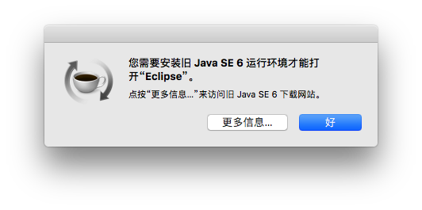

macos下打开ADT Bundle需要本机已安装Java SE 6，如下图所示，本文档只作一个过程记录，方便自己查看。



这是由于自从mac os升级到10.8之后，就把系统自带的1.6版本的jdk删掉，因此我们想在mac下打开ADT Bundle只能先安装jdk1.6。注意如果系统已经安装更高版本的jdk，此时系统需先卸载高版本的jdk，再安装jdk1.6。注意jdk1.6和高版本的jdk可以共存，但是必须先安装jdk1.6后再正常安装高版本的jdk。

## 卸载JDK

在安装JDK 1.6前需卸载系统安装的高版本JDK，下面均以JDK1.8为例。

```ruby
sudo rm -rf /Library/Java/JavaVirtualMachines/jdk1.8.0_112.jdk
sudo rm -rf /Library/PreferencePanes/JavaControlPanel.prefPane
sudo rm -rf /Library/Internet\ Plug-Ins/JavaAppletPlugin.plugin
sudo rm -rf /Library/LaunchAgents/com.oracle.java.Java-Updater.plist
sudo rm -rf /Library/PrivilegedHelperTools/com.oracle.java.JavaUpdateHelper
sudo rm -rf /Library/LaunchDaemons/com.oracle.java.Helper-Tool.plist
sudo rm -rf /Library/Preferences/com.oracle.java.Helper-Tool.plist
```

执行完以上命令后，在终端输入java命令。提示`No Java runtime present`表示已经卸载成功

## 安装JDK1.6

到苹果官网下载JDK 1.6。


## 安装JDK1.8

正常安装JDK 1.8。